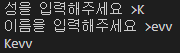

# [Python] 4. 조건문과 반복문 (1)

## __1. Input함수 및 조건문 _if, else___  

### __1) _Input_ 함수__

```py
# input 함수

text = input("성을 입력해주세요 >")
text2 = input("이름을 입력해주세요 >")

print(text + text2)
# 실행시키면
# 성을 입력해주세요 >
# (성을 입력 후)
# 이름을 입력해주세요 >
```




```py
# input 함수 - 정수형

number = int(input("첫번째 정수를 입력해주세요 >"))
number2 = int(input("두번째 정수를 입력해주세요 >"))

print(number + number2) # 첫번째 정수 + 두번째 정수

# result
# 첫번째 정수를 입력해주세요 >1
# 두번째 정수를 입력해주세요 >2
# 3
```

### __2) _if_ 문__

- _if_ 조건식 : 조건식이 <mark>참</mark>일때 실행할 문장

```py
# if문
# if True:
# (스페이스를 4칸 띄운 후에) print("실행할 문장입니다.")

if True:
    print("실행할 문장입니다.")
# result
# 실행할 문장입니다.
```

- _Visual Studio Code_ 하단 공백을 4로 설정하면 Tab키로 대체 가능


```py
#if 문 ex1)

weather = '비'

if weather == "비":
    print("우산을 챙겨주세요.")
# result : 우산을 챙겨주세요
```

```py
# if문 ex2)

study_time = int(input("오늘의 공부시간을 입력해주세요 : "))

# 만약에 오늘 공부한 시간이 3시간 이상이고 6시간 이하라면, 공부를 열심히 하셨네요!
if 6 >= study_time >= 3:
    print("공부를 열심히 하셨네요!")

# 만약에 오늘 공부한 시간이 3시간 미만이라면, 공부를 더 하십시오.
if study_time < 3:
    print("공부를 더 하십시요")

# 만약에 오늘 공부한 시간이 6시간 초과라면, 오늘은 쉬십시오.
if study_time > 6:
    print("오늘은 쉬십시오.")

# result
# 숫자를 3 이상 6 이하 입력시 : 공부를 열심히 하셨네요!
# 숫자를 3 미만 입력시 : 공부를 더 하십시오.
# 숫자를 6 초과 입력시 : 오늘은 쉬십시오.
```


### __3) _else_ 문__

- _if_ 조건식: 조건식이 <mark>참</mark>일 때 실행할 문장
- _else_ 조건식: 조건식이 <mark>거짓</mark>일 때 실행할 문장 

```py
# else문 ex1)
# 홀수와 짝수를 판별

odd = input("정수를 입력해 주세요 : ")

if odd[-1] == "1" or odd[-1] == "3" or odd[-1] == "5" or odd[-1] == "7" or odd[-1] == "9":
# odd[-1] == "1" : 끝자리가 1인 숫자라는 뜻
    print("입력하신 정수는 홀수 입니다.")
```

```py
# else문 ex2)
# 홀수와 짝수를 판별

odd = int(input("정수를 입력해 주세요 : "))

if odd % 2 == 1: ## 2로 나눴을때 나머지가 1인 숫자 = 홀수
    print("입력하신 정수는 홀수 입니다.")
else:
    print("입력하신 정수는 짝수 입니다.")
```

```py
# else문 ex3)
# 주민등록번호를 입력받아 성별을 파악
# 총 13자리 중 7번째 숫자를 판별해야 함

number = input("주민등록번호를 입력해주세요 : ")
odd = int(number[7])

if odd % 2 == 0: #짝수라면,
    print("여성입니다.")
else: # 짝수가 아닌 경우라면,
    print("남성입니다.")
```

## __2. _elif_ 문__  

- _if_ 조건식 A : 조건식 A가 <u>참</u>일 때 실행할 문장
- _elif_ 조건식 B : 조건식 B가 <u>참</u>일 때 실행할 문장
- _elif_ 조건식 C : 조건식 C가 <u>참</u>일 때 실행할 문장
- _else_ : 모든 조건식이 <u>거짓</u>일 때 실행할 문장
- `Java` 에서 _else if_ 문과 유사해 보인다 !

```py
# elif ex)
# 메뉴 선택하기

lunch = input("메뉴를 골라주세요. (제육덮밥, 돈까스, 김밥) : ")

if lunch == "제육덮밥":
    print("제육덮밥을 선택하셨습니다.")
elif lunch == "돈까스":
    print("돈까스를 선택하셨습니다.")
elif lunch == "김밥":
    print("김밥을 선택하셨습니다.")
else:
    print("잘못 선택하셨습니다. (제육덮밥, 돈까스, 김밥 중 선택해 주세요.)")
```

- _and, or_ 연산을 이용한 if문
  
```py
# and, or연산
# if문 여러 조건을 동시에 판별

# 3의 배수이면서 짝수인 수를 판별해주는 조건식

number = int(input("정수를 입력해 주세요 : "))

if number %3 == 0 and number %2 == 0: 
    print("3의 배수 이면서 짝수입니다.")
elif number %3 != 0:
    print("3의 배수가 아닙니다.")
else:
    print("짝수가 아닙니다.")
```

```py
# and, or연산
# if문 여러 조건을 동시에 판별

# 3의 배수 이거나 짝수인 수를 판별해주는 조건식

number = int(input("정수를 입력해 주세요 : "))

if number %3 == 0 or number %2 == 0:
    if number %3 == 0 and number %2 !=0:
        print("3의 배수 입니다. ")
    elif number %3 ==0 and number %2 ==0:
        print("3의 배수이면서 짝수 입니다.")
    else:
        print("짝수 입니다.")
else:
    print("3의 배수도 아니고 짝수도 아닙니다.")
```

```py
# if문 Quiz
# 웹사이트 주소를 입력해주세요 >
# kr = 한국 / uk = 영국 / org = 기관 / com = 기업용 / 그 외 = 알 수 없음

url = input("웹사이트 주소를 입력해주세요.")
domain = url.split(".") 
# 스플릿 함수로 . 을 기준으로 인덱스를 나눠 마지막 요소[-1] 를 통해 사이트 종류를 식별한다.

if domain[-1] == "kr":
    print("한국 사이트 입니다.")
elif domain[-1] == "uk":
    print("영국 사이트 입니다.")
elif domain[-1] == "org":
    print("기관용 사이트 입니다.")
elif domain[-1] == "com":
    print("기업용 사이트 입니다.")
else:
    print("알 수 없습니다.")
```
