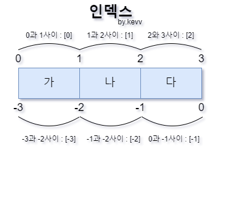
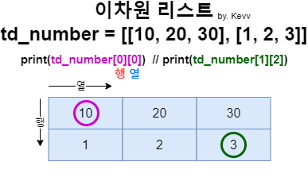

# [Python] 3. 복수의 데이터 다루기 (2)

## __3. _List_ 이해 및 실습__  

### __3) _list___

```py
# list [] 안에 ,(콤마)
list_a = [1, 2, 3, 4]
list_b = ["a", "b", "c"]
list_c = [True, False]
list_d = [1, "a", True]

print(list_a)
print(list_b)
print(list_c)
print(list_b)
# reslut
# [1, 2, 3, 4]   
# ['a', 'b', 'c']
# [True, False]
# ['a', 'b', 'c']
```

### __4) _list_ 의 인덱싱과 슬라이싱__

```py
numbers = [0, 1, 2, 3, 4, 5, 6, 7]

print(numbers[0])   # 0번째 인덱스
print(numbers[3:5]) # 3번째~5번째 전까지 슬라이싱

# result
# 0
# [3, 4]
```

```py
list_lang = ["JAVA", "C", "PYTHON", "GO"]

print(list_lang[0][1]) # 1번째 요소에서 2번째 문자를 표시
print(list_lang[2][2:4]) # 3번째 요소에서 2~3번째 문자를 표시
# result
# A
# TH

list_lang[1] = "C++" # 2번째 요소를 C++로 바꾼다
print(list_lang)
# result
# ['JAVA', 'C++', 'PYTHON', 'GO']

list_lang[1:3] = ["C#", "PYTHON3"] # 2~3번째 요소를 각각 C#, PYTHON3로 바꾼다
print(list_lang)
# result
# ['JAVA', 'C#', 'PYTHON3', 'GO']
```


### __5) _list_ 메서드 (요소를 추가하는 방법)__

- ___list( )___ , ___append( )___ , ___extend( )___ , ___insert( )___

```py
list_lang = ["JAVA", "C", "Python", "GO"]

print(len(list_lang)) # len()을 통해 list_lang의 갯수를 파악
# result : 4

# append() 리스트 맨 뒤에 "인덱스"를 추가 // 마지막 인덱스 : -1
list_lang.append("Ruby")
print(list_lang)
# result
# ['JAVA', 'C', 'Python', 'GO', 'Ruby']

# extend() 리스트 맨 뒤에 "요소"를 추가
list_a = [1, 2, 3]
list_lang.extend(list_a) # list_lang 마지막에 extend를 이용해 list_a의 요소를 추가
print(list_lang)
# result
# ['JAVA', 'C', 'Python', 'GO', 'Ruby', 1, 2, 3]

# insert(index, data) 원하는 위치에 데이터를 입력 가능
list_lang.insert(0, "R")
print(list_lang)
# result
# ['R', 'JAVA', 'C', 'Python', 'GO', 'Ruby', 1, 2, 3]
```

### __6) _list_ 메서드 (요소를 삭제하는 방법)__

- ___pop( )___, ___remove( )___, ___del___


```py
list_lang = ["JAVA", "C", "Python", "GO"]

# pop() 제일 뒤에있는 요소를 반환, 삭제하는 메서드
print(list_lang.pop()) # result : GO // GO를 반환시킴
print(list_lang)
# result
# ['JAVA', 'C', 'Python'] // 반환 된 Go 외의 값 출력

# remove() 해당 요소를 삭제
list_lang.remove("Python")
print(list_lang)
# result
# ['JAVA', 'C']

# del 지정한 인덱스를 삭제
del list_lang[1] # 2번째 인덱스를 삭제한다
print(list_lang)
# result
# ['JAVA']
```

### __7) _list_ 메서드 (기타 메서드)__

- __reverse( ), sort( ), sort(reverse = True)__ 

```py
# list 정렬로 숫자, 알파벳, 한글 모두 가능

numbers = [1000, 5000, 160, 100, 20, 1234]

# revers() 기존 순서 역순으로 정렬(내림차순x)
numbers.reverse()
print(numbers)
# result
# [1234, 20, 100, 160, 5000, 1000]

# sort() 오름차순으로 정렬
numbers.sort() 
print(numbers)
# result
# [20, 100, 160, 1000, 1234, 5000]

# sort(reverse = True) 내림차순으로 정렬
numbers.sort(reverse = True) 
print(numbers)
# result
# [5000, 1234, 1000, 160, 100, 20]


names = ["홍길동", "김철수", "박영희"]
names.reverse()
print(names)
# result
# ['박영희', '김철수', '홍길동']

names.sort()
print(names)
# result
# ['김철수', '박영희', '홍길동']

names.sort(reverse=True)
print(names)
# result
# ['홍길동', '박영희', '김철수']

# 숫자 뿐만 아니라 한글, 알파벳에서도 메서드 사용이 가능하다.
```

### __8) _ASCII_ (아스키코드)__

- [ASCII Table](https://www.asciitable.com/) 참고
- 문자열의 <mark>코드값</mark>을 비교해서 문자의 순서를 구분하게 된다.


### __9) _in_ 연산자와 _not in_ 연산자__

```py
# in 연산와 not in 연산자

list_lang = ["JAVA", "C", "Python", "Go"]
numbers = [1, 200, 3, 50, 5, 99, 7, 55, 9]

# in 연산자 : 값이 있으면 True, 없으면 False
print(50 in numbers) 
# result : True
print("C" in list_lang)
# result : True
print("Java script" in list_lang)
# result : False

# not in 연산자 : in 연산자와 반대
print(50 not in numbers) 
# result : False
print("C" not in list_lang)
# result : False
print("Java script" not in list_lang)
# result : True
```

### __10) _index_ 복습__




```py
text = ["가", "나", "다"]

print(text[1:2]) # result : ['나']
```

### __11) 이차원 _list___

- __이차원 _list_ 기초__



```py
# 이차원 list
td_number = [[10, 20, 30], [1, 2, 3]] 

print(td_number)
# result
# [[10, 20, 30], [1, 2, 3]]

print(td_number[0]) # 첫번째 리스트 출력
# result
# [10, 20, 30]

print(td_number[0][0]) # 1행 1열 요소 출력
# result
# 10

print(td_number[1][2]) # 2행 3열 요소 출력
# result
# 3
```

- __이차원 _list slicing___

```py
# 이차원 list slicing
td_number = [[10, 20, 30], [1, 2, 3]] 

print(td_number[0][0:2]) # 1행에서 1~2번째 요소 출력
# result
# [10, 20]

print(td_number[1][1:3]) # 2행에서 2~3번째 요소 출력
# result
# [2, 3]
```
___

## __4. _Tuple, Dictionary, Set_ 이해__  

### __1) _Tuple___

- ___tuple_ : 덧셈, 뺄셈, 곱셈 등 가능 하지만 추가, 삭제, 수정이 불가능하다.__

```py
# list[] // tuple()

numbers = (1, 2, 3)

print(numbers)
print(type(numbers))
# result
# (1, 2, 3)
# <class 'tuple'>

print(2 * numbers)
# result
# (1, 2, 3, 1, 2, 3)
```

- ___unpacking_ 안에 들어 있는 요소들을 여러 변수에 나누어서 대입__

```py
# 언팩킹

numbers = (1, 2, 3)

number1 = numbers[0]
number2 = numbers[1]
number3 = numbers[2]

print(number1, number2, number3)
# result : 1 2 3
```

```py
# 언팩킹 - 간단하게 코드 줄이면
# 요소의 갯수와 

numbers = (1, 2, 3)
number1, number2, number3 = numbers

print(number1, number2, number3)
# result : 1 2 3
```

```py
# 언팩킹할 요소의 갯수가 변수의 갯수보다 많으면 ValueError 발생

numbers = 1, 2, 3, 4  
number1, number2, *number3 = numbers 
# *을 이용해 에스터리스크를 사용하여 남는 요소 전체를 담을 변수를 만든다.

print(number1, number2, number3)
# result : 1 2 [3, 4]
```

```py
# 메모리의 주소값은 다르지만, 마치 tuple에 추가된것 처럼 표현하는 방법
# 새로운 tuple을 만들어 객체를 생성한 것

numbers = 1, 2, 3, 4  
print(id(numbers)) # id: 2020286484208


numbers += 5, 6
print(numbers) 
# result : (1, 2, 3, 4, 5, 6)
print(id(numbers)) # id: 2318642671872 
```

### __2) _Dictionary___
- __키와 값을 기반으로 값을 저장__
  
```py
# dictionary ex)

people = {
    "name": "김철수",
    "phone": "010-0000-0000"
}

print(people["name"],people["phone"]) 
# result
# 김철수 010-0000-0000
```

```py
# ex2)

books = {"Daniel Pink":["파는것이 인간이다.","언제 할 것인가"], "Eric Schidt":"새로운 디지털 시대"}

print(books["Daniel Pink"])
# result
# ['파는것이 인간이다.', '언제 할 것인가']

print(books["Eric Schidt"])
# result
# 새로운 디지털 시대
```

```py
# ex3) dictionary 요소 추가

coffee = {"JAVA":2500, "Americano":2500, "Latte":3000}

coffee["JAVA"] = 3000 # 요소의 값 변경
print(coffee["JAVA"]) # result : 3000

coffee["Moca"] = 3500 # 값 추가 방법
print(coffee)
# result
# {'JAVA': 3000, 'Americano': 2500, 'Latte': 3000, 'Moca': 3500}

del coffee["JAVA"] # 값 삭제 방법 1
print(coffee)
# result
# {'Americano': 2500, 'Latte': 3000, 'Moca': 3500}

coffee.pop("Latte") # 값 삭제 방법 2
print(coffee)
# result
# {'Americano': 2500, 'Moca': 3500}
```

- ___Dictionary Method (.get, .keys, .values, .items, in & not in 연산자)___
  
```py
# dictionary Method 

coffee = {"Java":2500, "Americano":2500, "Latte":3000}
coffee["Moca"] = 3500 

# .get 메서드 : key값을 이용해 요소 확인
print(coffee.get("Latte")) # result : 3000

#.keys 메서드 : 모든 키를 확인(keys)
print(coffee.keys()) 
# result
# dict_keys(['Java', 'Americano', 'Latte', 'Moca'])

#.values 메서드 : 모든 값을 확인
print(coffee.values())
# result
# dict_values([2500, 2500, 3000, 3500])

#.items 메서드 : 모든 키와 값을 확인(items)
print(coffee.items())
# result
# dict_items([('Java', 2500), ('Americano', 2500), ('Latte', 3000), ('Moca', 3500)])

# it 연산자와 not in 연산자
print("Latte" in coffee) # True
print("Americano" not in coffee) # False
```

### __3) 집합__

```py
# 집합 : 순서가 정해져 있지 않고, 중복 허용 되지 않음

week = {"월요일", "화요일", "수요일", "목요일", "금요일", "토요일", "일요일"}
print(week)

# result 
# {'월요일', '목요일', '화요일', '일요일', '금요일', '토요일', '수요일'}

# Add 메서드 : 집합 요소 추가
week.add("화요일") # 화요일이 중복됨으로 적용되지 않음.
print(week)
# result
# {'월요일', '목요일', '화요일', '일요일', '금요일', '토요일', '수요일'}

# .add를 이용해 tuple 추가 : tuple의 형태로 추가됨
week.add(("일주일",))
print(week)
# result 
# {'월요일', '수요일', ('일주일',), '목요일', '금요일', '일요일', '화요일', '토요일'} 

# .update를 이용해 tuple 추가 : 요소만 추가
week.update(("일주일",))
print(week)
# result
# {'일요일', '금요일', '토요일', ('일주일',), '화요일', '월요일', '수요일', '일주일', '목요일'}
```

- __집합을 통한 연산__
  - 합집합(|), 교집합(&), 차집합(-)
  - 합집합(|) - 두 집합의 모든 원소를 합한 집합
  - 교집합(&) - 공통된 원소의 집합
  - 차집합(-) - a라는 집합에서 b라는 집합에 있는 원소를 뺀 집합
  - 원소 삭제 _(.remove)_

```py
# 집합을 통한 연산

a = {1, 2, 3, 4, 5}
b = {3, 4, 5, 6, 7}

# 합집합(|)
print(a | b)
# result
# {1, 2, 3, 4, 5, 6, 7}

# 교집합(&)
print(a & b)
# result
# {3, 4, 5}

# 차집합(-)
print(a - b)
# result
# {1, 2}
```

```py
# 원소 삭제하는 방법

a = {1, 2, 3, 4, 5}
b = {3, 4, 5, 6, 7}

a.remove(4)
print(a)

# result
# {1, 2, 3, 5}
```