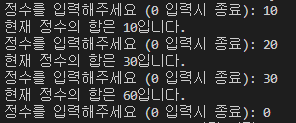

# [Python] 4. 조건문과 반복문 (2)

## __3. _while_ 구문 및 _range_ 함수__  

### __1)  _while_ 문__

- _while_ 문 (반복문)
  - while 조건식 : 조건식이 <mark>참</mark> 일동안 실행 할 문장.
  - 형식은 _if_ 문과 비슷하다.
  - _if_ 문은 참 일경우 1번만 실행되고, _while_ 문은 참 일동안 계속 식행된다.

```py
print("Hello World!\n" * 10) # Hello World! 를 10번 반복

# 일일히 작성하기 귀찮아질 뿐더러, 실수 할 확률도 높아짐
print(1)
print(1+1)
print(1+1+1)
print(1+1+1+1)
print(1+1+1+1+1)

# while 문을 이용해 간편하고 실수 없이 실행 가능.
i = 0
num = 0
while i < num:
    i = i +1
    print(i)
```

```py
# ex)
num = 0

while num < 5: # num에 입력되는 값이 5보다 작을때까지 실행된다.
    num += 1
    print(num)

# result
1
2
3
4
5
```

- _while_ 문에도 _else_ 문을 사용할 수 있다.
  
```py
# ex)
num = 0

while num < 5: # num에 입력되는 값이 5보다 작을때까지 실행된다.
    num += 1
    print(num)

else:
    print("값이 {}이상이므로 종료합니다.".format(num))

# result
1
2
3
4
5
값이 5이상이므로 종료합니다.
```

```py
# 리스트를 활용한 while문
# 과일 리스트 에서 요소를 선택하여 제거

fruits = ["사과", "키위", "바나나", "사과", "바나나", "망고"]
print(fruits)
fruit = input("빼낼 과일을 입력해주세요 : ")

# while문은 참일경우 계속 실행됨으로, 사과 입력시 모든 사과 요소는 제거된다.
while fruit in fruits:    
    fruits.remove(fruit)

print(fruits)
print("{}를 모두 제거했습니다." .format(fruit))
```

### __2) _if_ 문과 _while_ 문__

```py
# 숫자 범위 내에서의 홀수,짝수 판별

min_num = int(input("최소값 입력"))
max_num = int(input("최대값 입력"))

#홀수, 짝수 리스트 생성
odd_list = []
even_list = []

# 제어변수에 최소값 할당
num = min_num

# 최소값이 최대값보다 작을 경우에만 실행
if min_num < max_num:
    while num <= max_num:                    # 제어변수가 최대값이 될 때까지 반복실행
        if num % 2 == 0 :                   # 짝수, 홀수 판별
            even_list.append(num)           # 짝수를 짝수 리스트에 요소로 추가
        else: # 홀수 판별
            odd_list.append(num)            # 홀수를 홀수 리스트에 요소로 추가
        num += 1
    print("{}부터 {}까지의 짝수는 {}입니다." .format(max_num, min_num, even_list))
    print("{}부터 {}까지의 짝수는 {}입니다." .format(max_num, min_num, odd_list))
    # print 구문이 while문이 아닌, if문에 속해있어야 정상적으로 출력이 가능하게 됨
    
else:                                       # 최소값이 최대값보다 크거나 같을경우 실행됨
    print("최대값 {}이(가) 최소값{}보다 크지 않습니다.".format(max_num, min_num))
    pass
```

### __3) _Range_ 함수__

- 지정한 범위 내의 숫자를 표현해주는 함수
- 마지막 지정 숫자는 표현되지 않음
- 음수도 가능, 스텝도 가능

```py
# range 함수
# 지정한 범위 내의 숫자를 표현해주는 함수
numbers = list(range(0, 10)) # 마지막 지정 숫자는 표현되지 않음
print(numbers)

# result
[0, 1, 2, 3, 4, 5, 6, 7, 8, 9]
```

```py
# range 함수 스텝 이용 가능
# 지정한 스텝만큼 건너뛴 결과값 도출

numbers = list(range(-10, 0, 2)) 
# -1 부터 -10 까지 2칸씩 건너뛴 숫자를 나열
print(numbers)

# result
[-10, -8, -6, -4, -2]
```
---

## __4. _for_ 반복문__

### __1) _for_ 문의 형태__

```py
for 변수 in 나열가능한 자료:
    실행할 문장
```

```py
# for문

for i in range(1, 10+1):
    print(i)

# result
1
2
3
4
5
6
7
8
9
10
```

```py
# for문
# 문자열 사용

for i in "일이삼사오":
    print(i)

# result
일
이
삼
사
오
```

```py
# for문
# 리스트 사용

fruits = ["사과", "딸기", "바나나"]

for i in fruits:
    print("과일 바구니에 {}가 들어 있습니다.".format(i))

# result
과일 바구니에 사과가 들어 있습니다.
과일 바구니에 딸기가 들어 있습니다.
과일 바구니에 바나나가 들어 있습니다.
```

```py
# 1부터 30까지의 수 중에서 3의 배수들의 합을 구하시오.
# 3의 배수 : %3 == 0

sum = 0

for i in range(1, 30+1):
    if i % 3 == 0:
        print("{} + {} =".format(sum, i), end = "")
        sum += i
print(sum)

# result
0 + 3 =3 + 6 =9 + 9 =18 + 12 =30 + 15 =45 + 18 =63 + 21 =84 + 24 =108 + 27 =135 + 30 =165
```

```py
# step을 이용해 if문을 사용하지 않고 더 간결한 코드 가능

sum = 0

for i in range(3, 30+1, 3):  
        print("{} + {} =".format(sum, i), end = "")
        sum += i
print(sum)

# result
0 + 3 =3 + 6 =9 + 9 =18 + 12 =30 + 15 =45 + 18 =63 + 21 =84 + 24 =108 + 27 =135 + 30 =165
```

### __2)  _dictionary_ 를 이용한 _for_ 문__

```py
# dictionary를 이용한 for문

coffee = {"아메리카노" : 2500, "라떼" : 3000, "모카" : 2500}

for i in coffee.items(): # .values(), .key() 도 이용 가능.
    print(i)
# result
('아메리카노', 2500)
('라떼', 3000)
('모카', 2500)
```

### __3)  _enumerate_ 함수__

- 인덱스 번호와 요소를 함께 나타내어준다.

```py
# enumerate 함수
# 인덱스 번호와 요소를 함께 나타내준다.

fruits = ["사과", "딸기", "바나나"]

for i in enumerate(fruits):
    print(f"{i[0]+1}번째 과일은 {i[1]}입니다.")

# result
1번째 과일은 사과입니다.
2번째 과일은 딸기입니다.
3번째 과일은 바나나입니다.
```

```py
# enumerate 함수
# ex2)

fruits = ["사과", "딸기", "바나나"]

for i, j in enumerate(fruits):
    print(f"{i+1}번째 과일은 {j}입니다.")

# result
1번째 과일은 사과입니다.
2번째 과일은 딸기입니다.
3번째 과일은 바나나입니다.
```

### __4) 중첩 _for_ 문__

- 중첩 _for_ 문을 이용한 _list_ 확인

```py
# 중첩 for문을 이용한 list 확인
# ex1)

list_2nd = [[1, 2, 3], ["a", "b", "c"]]

for i in list_2nd:
    print(i)
    for j in i:
        print(j)
# result
[1, 2, 3]
1
2
3
['a', 'b', 'c']
a
b
c
```

```py
# 중첩 for문을 이용한 list 확인
# ex2)

for i in range(1, 3):
    for j in range(1, 3):
        print("첫번째 for문의 반복 {}번, 두번째 for문의 반복 {}번".format(i, j))

#result
첫번째 for문의 반복 1번, 두번째 for문의 반복 1번
첫번째 for문의 반복 1번, 두번째 for문의 반복 2번
첫번째 for문의 반복 2번, 두번째 for문의 반복 1번
첫번째 for문의 반복 2번, 두번째 for문의 반복 2번
```
- 구구단 만들기
  
```py
# 중첩 for문
# 구구단 만들기
# 2단부터 9단까지 = 8번 반복
# 1부터 9까지 = 9번 반복

for i in range(2, 9+1):
    for j in range(1, 9+1):
        print(f"{i} X {j} = {i*j}", end = "\t")
    print()

# result 아래 사진
```


- 3중 _for_ 문

```py
# 3중 for문
# 3차원 list

list_3rd = [[[1,2,3], [4,5,6]],[[11,12,13], [14,15,16]]]

cnt1 = 0
cnt2 = 0
cnt3 = 0
for i in list_3rd:
    cnt1 += 1
    print("i의 {}번째 반복입니다.".format(cnt1))
    print(i)
    for j in i:
        cnt2 += 1
        print("j의 {}번째 반복입니다.".format(cnt2))
        print(j)
        for k in j:
            cnt3 += 1
            print("k의 {}번째 반복입니다.".format(cnt3))
            print(k)
print('i는 {}번 반복, j는 {}번 반복, k는 {}번 반복'.format(cnt1, cnt2, cnt3))

# result 아래 사진
```


### __5) _for_ 반복문 실습 및 탈출문__

- _break_ 문 : 반복문을 중단
- _continue_ 문 : 반복문을 생략

- _break_ 문 ↓

```py
# break 문

i = 0

while True:
    print("{}번 째 반복입니다.".format(i))
    i += 1
    if i > 10:
        break

#result
0번 째 반복입니다.
1번 째 반복입니다.
2번 째 반복입니다.
3번 째 반복입니다.
4번 째 반복입니다.
5번 째 반복입니다.
6번 째 반복입니다.
7번 째 반복입니다.
8번 째 반복입니다.
9번 째 반복입니다.
10번 째 반복입니다.
```

```py
# break문
# ex1)
sum_ = 0

while True:
    num = int(input("정수를 입력해주세요 (0 입력시 종료): "))
    if num == 0:
        break
    sum_ += num
    print("현재 정수의 합은 {}입니다.".format(sum_))
```


- _continue_ 문
  - 조건식이 True면 다시 처음으로 올라가고, 조건식이 False면 아래로 내려간다
  
```py
# continue 문

numbers = [10, 200, 30, 400, 50]

for i in numbers:
    if i < 200:
        continue # 조건식이 참이면 다시 처음으로 올라가고, 조건식이 False면 아래로 내려간다
    print("{}은 200이상의 숫자입니다.".format(i))

# result
200은 200이상의 숫자입니다.
400은 200이상의 숫자입니다.
```

### Quiz
>menu = {"아이스 아메리카노": 3000, "아메리카노": 2500, "아이스 라떼": 4000, "라떼": 3500, "아이스크림": 8000}

>A. 결과 <br/>
차가운메뉴 <br/>
제품명: 아이스 아메리카노, 가격: 3000원 <br/>
제품명: 아이스라떼, 가격: 4000원 <br/>
제품명: 아이스크림, 가격: 8000원 <br/>
뜨거운메뉴 <br/>
제품명: 아메리카노, 가격: 2500원 <br/>
제품명: 라떼, 가격: 3500원 <br/>

```py
# Quiz

# key = 제품의 이름, value = 가격
menu = {"아이스 아메리카노": 3000, "아메리카노": 2500, "아이스 라떼": 4000, "라떼": 3500, "아이스크림": 8000}

ice_menu = {}
hot_menu = {}

for i,j in menu.items():
    if i[0:3] == "아이스":
        ice_menu[i] = j
    else:
        hot_menu[i] = j

print("차가운 메뉴")
for i, j in ice_menu.items():
    print("제품명: {} , 가격: {}원".format(i, j))
print("뜨거운 메뉴")
for i,j in hot_menu.items():
    print("제품명: {} , 가격: {}원".format(i, j))

# result
차가운 메뉴
제품명: 아이스 아메리카노 , 가격: 3000원
제품명: 아이스 라떼 , 가격: 4000원
제품명: 아이스크림 , 가격: 8000원
뜨거운 메뉴
제품명: 아메리카노 , 가격: 2500원
제품명: 라떼 , 가격: 3500원
```