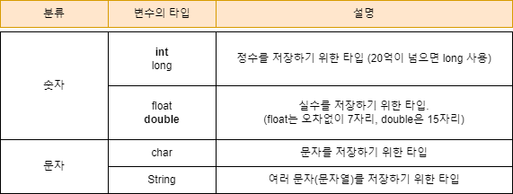
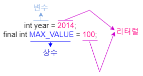

# [JAVA의 정석] CH2. 변수 

## 03) 변수의 선언과 저장

__변수__ : 하나의 __값__ 을 저장할 수 있는 __저장공간__ <br>

- 변수를 선언하는 방법 : __변수타입 변수이름;__ ex) __int age;__
- 주의 : 수학에서는 '=' 가 같음을 의미하지만, <u> 자바에서는 오른쪽 값을 왼쪽에 저장 </u> 하라는 의미의 __'대입 연산자(assignment operator)'__ 이다. <br>

## 04) 변수의 타입



## 5) 상수와 리터럴

__변수 (variable)__ : 하나의 값을 저장하기 위한 공간
__상수 (constant)__ : 값을 한번만 저장할 수 있는 공간
__리터럴 (literal)__ : 그 자체로 값을 의미하는 것



## 06) 리터럴의 타입과 전미사

- 접미사를 쓰는 경우는 정수형 long 일때 L , 실수형 float 일때 f (접미사는 대소문자 상관 없이 사용해도 된다. 다만 소문자 L의 경우 숫자 1이나 대문자 i와 혼동될 수 있으므로 대문자로 적는걸 권장한다.)

## 08) 문자열 결합

```java
class Ex2_7 {
	public static void main(String[] args) {
		String name = "Ja" + "va";
		String str  = name + 8.0;

		System.out.println(name);
		System.out.println(str);
		System.out.println(7 + " ");
		System.out.println(" " + 7);
		System.out.println(7 + "");
		System.out.println("" + 7);
		System.out.println("" + "");
		System.out.println(7 + 7 + "");
		System.out.println("" + 7 + 7);
	}
}
```


