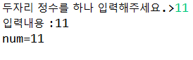

# [JAVA의 정석] CH2. 변수 

## 03) 변수의 선언과 저장

__변수__ : 하나의 __값__ 을 저장할 수 있는 __저장공간__ <br>

- 변수를 선언하는 방법 : __변수타입 변수이름;__ ex) __int age;__
- 주의 : 수학에서는 '=' 가 같음을 의미하지만, <u> 자바에서는 오른쪽 값을 왼쪽에 저장 </u> 하라는 의미의 __'대입 연산자(assignment operator)'__ 이다. <br>

## 04) 변수의 타입


## 5) 상수와 리터럴

__변수 (variable)__ : 하나의 값을 저장하기 위한 공간
__상수 (constant)__ : 값을 한번만 저장할 수 있는 공간
__리터럴 (literal)__ : 그 자체로 값을 의미하는 것


## 06) 리터럴의 타입과 전미사

- 접미사를 쓰는 경우는 정수형 long 일때 L , 실수형 float 일때 f (접미사는 대소문자 상관 없이 사용해도 된다. 다만 소문자 L의 경우 숫자 1이나 대문자 i와 혼동될 수 있으므로 대문자로 적는걸 권장한다.)

## 08) 문자열 결합

```java
class Ex2_7 {
	public static void main(String[] args) {
		String name = "Ja" + "va";
		String str  = name + 8.0;

		System.out.println(name); //Java
		System.out.println(str); //Java8.0
		System.out.println(7 + " "); //7
		System.out.println(" " + 7); // 7
		System.out.println(7 + ""); //7
		System.out.println("" + 7); //7
		System.out.println("" + ""); //  
		System.out.println(7 + 7 + ""); //14
		System.out.println("" + 7 + 7); //77
	}
}
```

## 09) 두 변수의 값 바꾸기

```java
int x = 10;
int y = 20;
```

- x 의 값과 y의 값을 서로 바꾸기 위해서, 임시적으로 x값과 y값을 저장해 둘 저장소가 필요하다. <br>

```java
int tmp;  //임시로 값을 저장하기 위한 변수 
temp = x;  //1. x의 값을 temp에 저장
x = y;    //2. y의 값을 x에 저장 
y = tmp;  //3. tmp에 저장된 x의 값을 y에 저장 
```

- 쥬스와 우유가 담겨져 있는 컵에서 서로의 내용물을 바꾸기 위해서는, 임시로 쥬스나 우유를 저장해 둘 빈 컵이 하나 더 필요하다고 생각하면 이해하기 쉽다.

## 10) 기본형과 참조형

__기본형 (primitive type)__

- 논리형, 문자형, 정수형, 실수형
- ___계산을 위한 실제 값을 저장한다.___ 총 8개

__참조형(reference type)__

- ___객체의 주소를 저장한다.___ 8개의 기본형을 제외한 나머지 타입.

## 11) 기본형의 종류와 범위


- n비트로 표현할 수 있는 값의 갯수 : 2ⁿ 개

## 12) printf를 이용한 출력

- 같은 값이라도 다른형식으로 출력하고 싶을때 pirntf()를 이용
- 예를들어 소수점 둘째자리까지만 출력하거나, 10진수를 다른 진수로 출력할때 사용하면 된다.
- pirntf()는 '지시자 (specifier)' 를 통해 변수의 값을 여러가지 형식으로 변환하여 출력하는 기능을 갖고 있다.


```java
class Ex2_9 {
	public static void main(String[] args) {
		String url = "kevvblog.github.io";
		float f1 = .10f;   // 0.10, 1.0e-1
		float f2 = 1e1f;   // 10.0, 1.0e1, 1.0e+1
		float f3 = 3.14e3f;
		double d = 1.23456789;
		System.out.printf("f1=%f, %e, %g%n", f1, f1, f1); 
		System.out.printf("f2=%f, %e, %g%n", f2, f2, f2); 
		System.out.printf("f3=%f, %e, %g%n", f3, f3, f3);
		System.out.printf("d=%f%n", d);
		System.out.printf("d=%14.10f%n", d); // 전체 14자리 중 소수점 10자리
		System.out.printf("[12345678901234567890]%n");
		System.out.printf("[%s]%n", url);
		System.out.printf("[%20s]%n", url);	 // 지시자 앞에 숫자를 사용하여 출력할 자릿수를 설정
		System.out.printf("[%-20s]%n", url); // 왼쪽 정렬 (-를 이용하여 왼쪽 정렬)
		System.out.printf("[%.8s]%n", url);  // 왼쪽에서 8글자만 출력 (.8을 이용하여 부분출력)
	}
}
```

결과 ↓


- %f는 기본적으로 소수점 아래 6자리까지만 출력하기 때문에 소수점 아래 7자리에서 반올림 한다.


## 14) 화면으로부터 입력받기

- Scanner 클래스를 이용
- 1. import java.util.Scanner;  → Scanner 클래스를 사용하기 위해 추가
- 2. Scanner scanner = new Scanner(System.in); → Scanner 객체 생성 (System.in = 화면입력을 의미)
- 3. String input = scanner.nextLine(); → 입력받은 내용을 input에 저장 (nextLine() 메서드를 호출하면, 입력대기 상태에 있다가 입력을 마치고 엔터키를 누르면 입력한 내용이 문자열로 반환된다.)
- 4. int num = Integer.parseInt(input); → 입력받은 내용을 int타입의 값으로 변환 (Integer.ParseInt() 메서드 = 문자열의 int 타입의 정수로 변환)


```java
import java.util.Scanner;    // Scanner를 사용하기 위해 추가

class Ex2_10 { 
	public static void main(String[] args) { 
		Scanner scanner = new Scanner(System.in);

		System.out.print("두자리 정수를 하나 입력해주세요.>");
		String input = scanner.nextLine();
		int num = Integer.parseInt(input); // 입력받은 문자열을 숫자로 변환

		System.out.println("입력내용 :"+input);
		System.out.printf("num=%d%n", num);
	} 
}
```

11 입력시 결과 ↓




## 15) 오버플로우


## 17) 타입 간의 변환방법

1. 숫자를 문자로 변환 - 숫자에 '0'을 더한다.
   - (char)(3 + '0') → '3'
2. 문자를 숫자로 변환 - 문자에서 '0'을 뺀다.
   - '3' - '0' → 3
3. 숫자를 문자열로 변환 - 숫자에 빈 문자열 ("")을 더한다.
   - 3 + "" → "3:
4. __문자열을 숫자로 변환__ - _Integer.parseInt()_ 또는 _Double.parseDouble()_ 을 사용한다
   - Integer.parseInt("3") → 3
   - Double.parseDouble("3.14") → 3.14
5. 문자열을 문자로 변환 - charAt(0)을 사용한다.
   - "3".charAt(0) → '3'
6. 문자를 문자열로 변환 - 빈 문자열("") 을 더한다.
   - '3' + "" → "3"   