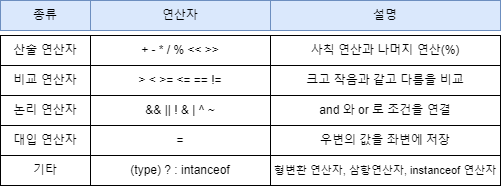
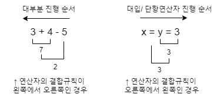
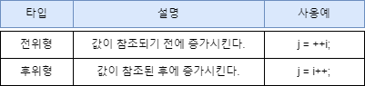
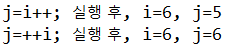
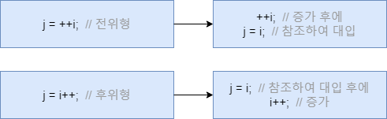

# [JAVA의 정석] CH3. 연산자 

## 02) 연산자의 종류



- 괄호 ( ) 는 연산자가 아니다.
- 비프 연산자 ( << >> & | ^ ~ ) 는 잘 쓰이지 않으나, 알고있으면 좋다.

## 03) 연산자의 우선순위

- 부호연산자(1항 연산자)와 뺄셈 연산자는 다르니, 잘 알아두자
- 상식적으로 생각하면 굳이 외우지 않아도 어렵지 않다.

## 04) 연산자의 결합법칙



- 1. 산술(+ =) > 비교(>,<) > 논리(&&,||) > 대입(=). 대입은 가장 마지막에 수행된다.
- 2. 단항(1) > 이항(2) > 삼항(3). 단항 연산자의 우선순위가 이항 연산자보다 높다.
- 3. 단항 연산자와 대입 연산자를 제외한 모든 연산의 진행방향은 왼쪽에서 오른쪽이다.

## 05) 증감연산자 ++, --

- __증가 연산자(++)__ : 피연산자의 값을 1 증가시킨다.
- __감소 연산자(--)__ : 피연산자의 값을 1 감소시킨다.
  


```java
class Ex3_2 {
	public static void main(String args[]) {
		int i=5, j=0;

		j = i++;
		System.out.println("j=i++; 실행 후, i=" + i +", j="+ j);

		i=5;        // 결과를 비교하기 위해, i와 j의 값을 다시 5와 0으로 변경
		j=0;

		j = ++i;
		System.out.println("j=++i; 실행 후, i=" + i +", j="+ j);
	}
}
```

결과 ↓




### 추가 설명




## 06) 부호 연산자

- 부호연산자는 덧셈, 뺄셈 연산자와 같은 기호를 쓰지만 다른 연산자이다. 기호는 같아도 피연산자의 개수가 달라서 구별이 가능하다.
- 이것 또한 상식적으로 생각하면 매우 쉽게구별 가능.
- '-' 는 피연산자의 부호를 반대로 변경
- '+' 는 아무런 일도 하지 않는다. (실제 사용x)

## 07) 형변환 연산자

- __형변환(casting)이란, 변수 또는 상수의 타입을 다른 타입으로 변환하는것.__
- 형변환 방법은 형변환하고자 하는 변수나 리터럴의 앞에 변환하고자 하는 타입을 괄호와 함께 붙여주기만 하면 된다.
- __(타입)피연산자__

```java
double d = 54.4;
int score = int(d);
```

- 위에 두줄의 연산과정을 단계별로 살펴보면
- int score = (int)d; → int score = (int)54.4; _// 이 과정에서 소수점 0.4 버려짐_ → int score = 54;

## 08) 자동 형변환

- 값손실이 나지 않는 범위에서 자동형변환이 된다.
- __"기존의 값을 최대한 보존할 수 있는 타입으로 자동 형변환된다."__


