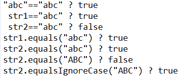
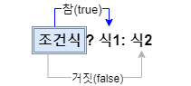
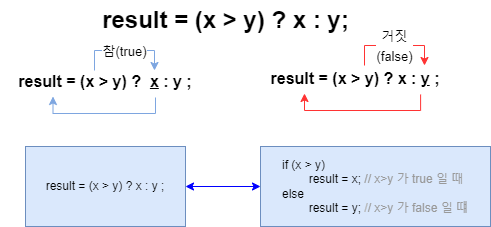
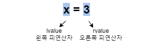

# [JAVA의 정석] CH3. 연산자 

## 02) 연산자의 종류


- 괄호 ( ) 는 연산자가 아니다.
- 비프 연산자 ( << >> & | ^ ~ ) 는 잘 쓰이지 않으나, 알고있으면 좋다.

## 03) 연산자의 우선순위

- 부호연산자(1항 연산자)와 뺄셈 연산자는 다르니, 잘 알아두자
- 상식적으로 생각하면 굳이 외우지 않아도 어렵지 않다.

## 04) 연산자의 결합법칙


- 1) 산술(+ =) > 비교(>,<) > 논리(&&,||) > 대입(=) // 대입은 가장 마지막에 수행된다.
- 2) 단항(1) > 이항(2) > 삼항(3) // 단항 연산자의 우선순위가 이항 연산자보다 높다.
- 3) 단항 연산자와 대입 연산자를 제외한 모든 연산의 진행방향은 왼쪽에서 오른쪽이다.

## 05) 증감연산자 ++, --

- __증가 연산자(++)__ : 피연산자의 값을 1 증가시킨다.
- __감소 연산자(--)__ : 피연산자의 값을 1 감소시킨다.
  


```java
class Ex3_2 {
	public static void main(String args[]) {
		int i=5, j=0;

		j = i++;
		System.out.println("j=i++; 실행 후, i=" + i +", j="+ j);

		i=5;        // 결과를 비교하기 위해, i와 j의 값을 다시 5와 0으로 변경
		j=0;

		j = ++i;
		System.out.println("j=++i; 실행 후, i=" + i +", j="+ j);
	}
}
```

결과 ↓


### 추가 설명


## 06) 부호 연산자

- 부호연산자는 덧셈, 뺄셈 연산자와 같은 기호를 쓰지만 다른 연산자이다. 기호는 같아도 피연산자의 개수가 달라서 구별이 가능하다.
- 이것 또한 상식적으로 생각하면 매우 쉽게구별 가능.
- '-' 는 피연산자의 부호를 반대로 변경
- '+' 는 아무런 일도 하지 않는다. (실제 사용x)

## 07) 형변환 연산자

- __형변환(casting)이란, 변수 또는 상수의 타입을 다른 타입으로 변환하는것.__
- 형변환 방법은 형변환하고자 하는 변수나 리터럴의 앞에 변환하고자 하는 타입을 괄호와 함께 붙여주기만 하면 된다.
- __(타입)피연산자__

```java
double d = 54.4;
int score = int(d);
```

- 위에 두줄의 연산과정을 단계별로 살펴보면
- int score = (int)d; → int score = (int)54.4; _// 이 과정에서 소수점 0.4 버려짐_ → int score = 54;

## 08) 자동 형변환

- 값손실이 나지 않는 범위에서 자동형변환이 된다.
- __"기존의 값을 최대한 보존할 수 있는 타입으로 자동 형변환된다."__


## 10) 산술변환

- 두 연산자의 타입을 같게 일치시킨다. (보다 큰 타입으로 일치)
  - long + int → long + long → long
  - float + int → float + float → float
  - double + float → double + double → double
  
- 피연산자의 타입이 int보다 작은 타입이면 int로 변환된다.
  - byte + short → int + int → int
  - char + short → int + int → int

## 11) Math.round() 로 반올림하기

- 반올림을 하려면 Math.round() 를 사용하면 된다. (Math 클래스에 있는 round 메소드)
- Math.round()를 이용하면 소수점 첫째 자리에서 반올림 한 결과를 정수료 반환한다.
- __long result = Math.round(4.52);__ _// result에 5가 저장된다)_

```java
class Ex3_11 {
	public static void main(String args[]) { 
		double pi = 3.141592; 
		double shortPi = Math.round(pi * 1000) / 1000.0;
		// 소수점 3번째 자리까지 표현하려면 1000을 Math.round()에서 곱하고, 다시 1000.0을 나눈다
		// double 형식으로 써야 소숫점까지 결과로 나오기때문에 int형식인 1000이 아닌 1000.0 으로 나눈다.
		// 1000으로 나눌경우 결과값으로 3이 나온다.
		System.out.println(shortPi);
	}
}

// result : 3.142
```

## 12) 나머지 연산자 (%)

- 나머지 연산자는 주로 짝수, 홀수 또는 배수 검사등에 주로 사용된다.

```java
class Ex3_13 { 
	public static void main(String[] args) { 
		System.out.println(-10%8); 
		System.out.println(10%-8); 
		System.out.println(-10%-8); 
	} 
}

// result : -2
//			2
//          -2
```

- __System.out.println(10%8);__  _// 10을 8로 나눈 나머지 2가 출력된다.
- __System.out.println(10%-8);__  _// 10을 -8로 나눈 나머지 2가 출력된다. (위와 같은 결과를 얻음)
- 10을 8로 나눈 나머지 = 10을 -8로 나눈 나머지 → '-'의 의미가 없다.

## 13) 비교 연산자

### 대소비교 연산자 < > <= >=

- __>__ : 좌변 값이 __크면__, true 아니면 false
- __<__ : 좌변 값이 __작으면__, true 아니면 false
- __>=__ : 좌변 값이 __크거나 같으면__, true 아니면 false
- __<=__ : 좌변 값이 __작거나 같으면__, true 아니면 false

### 등가비교 연산자 == !=

- __==__ : 두 값이 __같으면__,  true 아니면 false
- __!=__ : 두 값이 __다르면__,  true 아니면 false

- 대소비교 연산자와 등가비교 연산자를 사용할때 등호의 순서에 유의하자.

## 14) 문자열의 비교

- 두 문자열을 비교할때는 비교연산자 '=='대신, __equals()__ 라는 메서드를 사용해야 한다.

```java
class Ex3_14 {
	public static void main(String[] args) {
		String str1 = "abc";
		String str2 = new String("abc");

		System.out.printf("\"abc\"==\"abc\" ? %b%n", "abc"=="abc");
		System.out.printf(" str1==\"abc\" ? %b%n",    str1=="abc");
		System.out.printf(" str2==\"abc\" ? %b%n",    str2=="abc");
		System.out.printf("str1.equals(\"abc\") ? %b%n", str1.equals("abc"));
		System.out.printf("str2.equals(\"abc\") ? %b%n", str2.equals("abc")); 
		System.out.printf("str2.equals(\"ABC\") ? %b%n", str2.equals("ABC"));
		System.out.printf("str2.equalsIgnoreCase(\"ABC\") ? %b%n", str2.equalsIgnoreCase("ABC"));
	}
}
```

결과 ↓



## 15) 논리연산자 && ||

- __||(or결합)__ : 피연산자 중 어느 한쪽이 true이면 true를 결과로 얻는다.
- __&&(and결합)__ : 피연산자 양쪽 모두 true여야 true를 결과로 얻는다.
- && 와 || 이 함께 쓰일때는 괄호를 이용해 명확하게 구분한다.

## 16) 논리 부정 연산자 !

- 논리 부정 연산자 (!) : 피연산자가 true이면 false를, false이면 true를 결과로 변환한다.
- true와 false를 반대로 바꾸는 것.
- ch < 'a' || ch > 'z'	↔	!('a' <= ch && ch <= 'z')

## 17) 조건 연산자

- 조건 연산자 : 조건식, 식1, 식2 모두 세 개의 피연산자를 필요로 하는 삼항 연산자이며, 삼항 연산자는 조건 연산자 하나뿐이다.
- 조건 연산자를 이용해 if문을 간단하게 표현 가능하다.





## 18) 대입 연산자

- 오른쪽 피연산자의 값을 왼쪽 피연산자에 저장한다.
- 그리고 저장된 값을 연산결과로 반환한다.
- 모든 연산자는 결과값을 반환한다
- ← 방향으로 진행

### lvalue 와 rvalue

- 대입연산자의 왼쪽 피연산자를 'lvalue(left value)' 라고 하고, 오른쪽 피연산자를 'rvalue(right value)' 라고 한다.



## 19) 복합 대입 연산자
