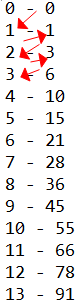

# [JAVA의 정석] CH4. 조건문과 반복문

## CH4. 조건문과 반복문

- 조건문 + 반복문 = 제어문(flow statement)
- 조건문
  - if문, swich문
  - 조건을 만족할때만 {} 를 수행 (0 ~ 1번)
- 반복문
  - while문, for문
  - 조건을 만족하는동안 {} 를 수행 (0 ~ n번)

## 01) if문

- if문 : 조건식이 '참(true)'일 때 {} 안의 문장들을 수행한다.
  - 꼭 true 혹은 false로 반환되어야 한다.
  
```java
if (조건식) {
	// 조건식이 참(true)일 때 수행될 문장들을 적는다.
}
```

```java
if (score > 60) {
	System.out.println("합격입니다");
} 
```

## 02) 조건식의 다양한 예



## 03) 블럭{}

- {} : 여러 문장을 하나의 단위로 묶음
- 끝을 의미하는 ;를 블록의 끝에 붙이지 않는다.

## 04) if-else문

- 둘 중 하나.

```java
if (조건식) {
	//조건이 참(true)일 때 수행될 문장들을 적는다.
} else {
	//조건이 거짓(false)일 때 수행될 문장들을 적는다.
}
```

```java
if(input==0) {
	System.out.println("0 입니다.");
} else {
	System.out.println("0 이 아닙니다.");
}
```

## 05) if-else if문

- 여러개 중 하나.

```java
if (조건식1) {
	//조건식1의 연산결과가 참일 때 수행될 문장들을 적는다.
} else if(조건식2) {
	//조건식2의 연산결과가 참일 때 수행될 문장들을 적는다.
} else if(조건식3) {
	//조건식3의 연산결과가 참일 때 수행될 문장들을 적는다.
} else { // 마지막은 보통 else블럭으로 끝나며, else 블럭은 생략이 가능하다.
	// 위에 어떠한 조건식도 만족하지 않을 때 수행될 문장들을 적는다.
}
```

## 06) if-else if문 예제

```java
import java.util.Scanner;

class Ex4_4 {
	public static void main(String[] args) { 
		int score  = 0;   // 점수를 저장하기 위한 변수
		char grade =' ';  // 학점을 저장하기 위한 변수. 공백으로 초기화한다.

		System.out.print("점수를 입력하세요.>");
		Scanner scanner = new Scanner(System.in);
		score = scanner.nextInt(); // 화면을 통해 입력받은 숫자를 score에 저장

		if (score >= 90) {         // score가 90점 보다 같거나 크면 A학점
			 grade = 'A';             
		} else if (score >=80) {   // score가 80점 보다 같거나 크면 B학점 
			 grade = 'B'; 
		} else if (score >=70) {   // score가 70점 보다 같거나 크면 C학점 
			 grade = 'C'; 
		} else {                   // 나머지는 D학점
			 grade = 'D'; 
		}
		System.out.println("당신의 학점은 "+ grade +"입니다.");
	}
}
```

## 07) 중첩 if문

- if문의 블럭 내에 또 다른 if문을 포함시키는것.
- 중첩 횟수에는 제한이 없고, 구문별 블럭{} 처리에 주의하자.

```java
if(조건식1) {
	//조건식1의 연산결과가 true일 때 수행될 문장들을 적는다.
	if(조건식2) {
		//조건식1과 조건식2가 모두 true일 때 수행될 문장들을 적는다.
	} else {
		//조건식1은 true이지만, 조건식2가 false일 때 수행될 문장들을 적는다.
	}
} else {
	// 조건식1이 false일 때 수행되는 문장들을 적는다.
}
```

## 08) 중첩 if문 예제

```java
import java.util.Scanner;

class Ex4_5 {
	public static void main(String[] args) { 
		int  score = 0;
		char grade = ' ', opt = '0';

		System.out.print("점수를 입력해주세요.>");

		Scanner scanner = new Scanner(System.in);
		score = scanner.nextInt(); // 화면을 통해 입력받은 점수를 score에 저장

		System.out.printf("당신의 점수는 %d입니다.%n", score);

		if (score >= 90) {           // score가 90점 보다 같거나 크면 A학점(grade)
			grade = 'A';
			if (score >= 98) {        // 90점 이상 중에서도 98점 이상은 A+
				opt = '+';	
			} else if (score < 94) {  // 90점 이상 94점 미만은 A-
				opt = '-';
			}
		} else if (score >= 80){     // score가 80점 보다 같거나 크면 B학점(grade)
			grade = 'B';
			if (score >= 88) {
				opt = '+';
			} else if (score < 84)	{
				opt = '-';
			}
		} else {                     // 나머지는 C학점(grade)
			grade = 'C';
		}	
		System.out.printf("당신의 학점은 %c%c입니다.%n", grade, opt);
	}
}
```

## 09) switch문

- 경우의 수가 많아지면 switch문을 이용한다.
- 무한 루프 방지를 위해 break; 를 빼먹지 않도록 유의하자.

- ① 조건식을 계산한다.
- ② 조건식의 결과와 일치하는 case문으로 이동한다.
- ③ 이후의 문장들을 수행한다.
- ④ break문이나 switch문의 끝을 만나면 switch문 전체를 빠져나간다.

## 10) switch문의 제약조건

- switch문의 조건식 결과는 __정수__ 또는 __문자열__ 이어야 한다. (jdk 버전에 따라 제약조건이 다를 수 있다.)
- case문의 값은 __정수, 상수(문자포함), 문자열__ 만 가능하며, 중복되지 않아야한다. (변수는 사용 불가)

## 11) switch문의 제약조건 예제

```java
import java.util.Scanner;

class Ex4_6 {
	public static void main(String[] args) { 
		System.out.print("현재 월을 입력하세요.>");

		Scanner scanner = new Scanner(System.in);
		int month = scanner.nextInt();  // 화면을 통해 입력받은 숫자를 month에 저장

		switch(month) {
			case 3: case 4:	case 5:
				System.out.println("현재의 계절은 봄입니다.");
				break;
			case 6: case 7: case 8:
				System.out.println("현재의 계절은 여름입니다.");
				break;
			case 9: case 10: case 11:
				System.out.println("현재의 계절은 가을입니다.");
				break;
			default:
	//		case 12:	case 1: case 2:
				System.out.println("현재의 계절은 겨울입니다.");
		}
	} // main의 끝
}
```

## 12) 임의의 정수 만들기 Math.random()

- 난수(임의의 수)를 얻기 위해서는 Math.random()을 사용해야 한다.
- 로또 번호 임의추첨기, 번호 맞추기 게임 등에 이용 가능

- __0.0 <= Math.random() < 1.0__ 

```java
class Ex4_7 {
	public static void main(String args[]) {
		int num = 0;

		// 괄호{} 안의 내용을 5번 반복한다.
		for (int i = 1; i <= 5; i++) {
			num = (int) (Math.random() * 6) + 1; 
			// (int)(Math.random() 형변환 후, 1부터 6 사이의 수를 랜덤하게 추첨
			System.out.println(num);
		}
	}
}
```

## 13) for문

- for문은 반복횟수를 알 때 사용한다.
- for문은 '초기화', '조건식', '증감식', '블럭{}' 모두 4부분으로 이루어져있으며, 조건식이 참인동안 블럭{}내의 문장들을 반복하다 거짓이 되면 반복문을 벗어나게 된다.
- for문 초기화시 항상 변수의 타입이 같아야 한다.

```java
for(int i=1; i<=5; i++;) {
	System.out.println("Kevv's blog");
}
```

## 14) for문 예제

```java
class Ex4_10 {
	public static void main(String[] args) { 
		int sum = 0;	// 합계를 저장하기 위한 변수.

		for(int i=1; i <= 5; i++) {
			sum += i ;	// sum = sum + i;
			System.out.printf("1부터 %2d 까지의 합: %2d%n", i, sum);
			// %2d = 2자리의 10진수를 의미한다.
		}
	} // main의 끝
}
```

## 15) 중첩 for문

- for문 안에 또 다른 for문을 포함시키는 것을 중첩 for문이라고 한다.
- 중첩횟수에는 제한이 없다.
- 구구단 프로그램 등에 활용된다.

```java
import java.util.*;

class Ex4_11 {
	public static void main(String[] args) { 

		for(int i=1;i<=5;i++) {
			for(int j=1;j<=i;j++) {  // j <= i 부분 확인.
				System.out.print("*");
			}
			System.out.println();
		}
	} // main의 끝
}
```

## 16) while문

- 반복횟수를 모를 때 사용된다.
- for문과 while문은 항상 서로 변환이 가능하다.

```java
while(조건식) {
	//조건식의 연산결과가 참(true)일 동안, 반복될 문장들을 적는다.
}
```

```java
class Ex4_12 {
	public static void main(String[] args) { 
		int i= 5;

		while(i--!=0) {
			System.out.println(i + " - I can do it.");
		}
	} // main의 끝
}

// //reseult
// 4 - I can do it.
// 3 - I can do it.
// 2 - I can do it.
// 1 - I can do it.
// 0 - I can do it.
```

```java
class Ex4_13 {
	public static void main(String[] args) {
		int sum = 0;
		int i = 0;
		// i를 1씩 증가시켜서 sum에 계속 더해나간다.
		while (sum <= 100) {
			System.out.printf("%d - %d%n", i, sum);
			sum += ++i;
		}
	} // main의 끝
}
```

결과 ↓


## 18) while문 예제2 

```java
import java.util.*;

class Ex4_14 {
	public static void main(String[] args) { 
		int num = 0, sum = 0;
		System.out.print("숫자를 입력하세요.(예:12345)>");

		Scanner scanner = new Scanner(System.in);
		String tmp = scanner.nextLine();  // 화면을 통해 입력받은 내용을 tmp에 저장
		num = Integer.parseInt(tmp);      // 입력받은 문자열(tmp)을 숫자로 변환
										  // 문자열 "12345"를 정수 12345로 변환 

		while(num!=0) {    
			// num을 10으로 나눈 나머지를 sum에 더함
			sum += num%10; 	// sum = sum + num%10;
			System.out.printf("sum=%3d num=%d%n", sum, num);

			num /= 10;   // num = num / 10;  num을 10으로 나눈 값을 다시 num에 저장
		}

		System.out.println("각 자리수의 합:"+sum);
	}
}

// result↓
// 숫자를 입력하세요.(예:12345)>123
// sum=  3 num=123
// sum=  5 num=12
// sum=  6 num=1
// 각 자리수의 합:6

```

## 19) do-while문

- while 문은 0번 실행될 수도 있지만
- do-while 문은 무조건 1번 이상은 반복된다.
- 사용자 입력받을 때 유용하다.

```java
import java.util.*;

class Ex4_15 {
	public static void main(String[] args) { 
		int input  = 0, answer = 0;

		answer = (int)(Math.random() * 100) + 1; // 1~100 사이의 임의의 수를 저장
		Scanner scanner = new Scanner(System.in);

		do {
			System.out.print("1과 100사이의 정수를 입력하세요.>");
			input = scanner.nextInt();

			if(input > answer) {
				System.out.println("더 작은 수로 다시 시도해보세요.");	
			} else if(input < answer) {
				System.out.println("더 큰 수로 다시 시도해보세요.");			
			}
		} while(input!=answer);

		System.out.println("정답입니다.");
	}
}
```

## 20) break문

- 무한반복을 방지한다.
- 주로 if문과 함께 사용되며 break문은 자신이 포함된 가장 가까운 반복문을 벗어난다.

- `while(true)` 를 for문에서 `for(;;)` 로 대체 가능하다.
- `sum += i; 와 ++i; 두 문장을 sum += ++i; 와 같이 한 문장으로 줄여 쓸 수 있다.`

```java
class Ex4_16 {
	public static void main(String[] args) { 
		int sum = 0;
		int i   = 0;

		while(true) {
			if(sum > 100)
				break;
			++i;
			sum += i;
		} // end of while

		System.out.println("i=" + i);
		System.out.println("sum=" + sum);
	}   
}
```

## 21) continue문

- continue문은 반복문 내에서만 사용될 수 있다.
- continue문을 만나게 되면 다음 반복으로 넘어간다. (건너뛴다고 생각하면 된다.)

```java
class Ex4_17 {
	public static void main(String[] args) {
		for(int i=0;i <= 10;i++) {
			if (i%3==0) // 3의 배수는 건너 뜀
				continue;
			System.out.println(i);
		}
	}
}

// result
// 1
// 2
// 4
// 5
// 7
// 8
// 10
```

## 22) break문과 continue문 예제

```java
import java.util.*;

class Ex4_18 {
	public static void main(String[] args) { 
		int menu = 0;
		int num  = 0;

		Scanner scanner = new Scanner(System.in);

		while(true) {
			System.out.println("(1) square");
			System.out.println("(2) square root");
			System.out.println("(3) log");
			System.out.print("원하는 메뉴(1~3)를 선택하세요.(종료:0)>");

			String tmp = scanner.nextLine(); // 화면에서 입력받은 내용을 tmp에 저장
			menu = Integer.parseInt(tmp);    // 입력받은 문자열(tmp)을 숫자로 변환

			if(menu==0) {
				System.out.println("프로그램을 종료합니다.");
				break;
			} else if (!(1 <= menu && menu <= 3)) { // 숫자를 1 ~ 3 사이로 입력 한 경우
				System.out.println("메뉴를 잘못 선택하셨습니다.(종료는 0)");
				continue;		
			}
			
			System.out.println("선택하신 메뉴는 "+ menu +"번입니다.");
		}
	} // main의 끝
}
```

## 23) 이름 붙은 반복문

- break문은 근접한 단 하나의 반복문만 벗어날 수 있다.
- 여러개의 반복문이 중첩된 경우에는 break문으로 중첩 반복문을 완전히 벗어날 수 었다.
- 중첩 반복문 앞에 `이름`을 붙이고 `break`문과 `continue`문에 __이름을 지정해 줌__으로써 하나 이상의 반복문을 벗어나거나 반복문을 건너뛸 수 있다.
- ex) ```Loop1 : for (조건식) { }```

```java
class Ex4_19
{
	public static void main(String[] args)
	{
      // for문에 Loop1이라는 이름을 붙였다.
		Loop1 : for(int i=2;i <=9;i++) {	
				for(int j=1;j <=9;j++) {
					if(j==5)
						break Loop1; // break문 뒤에 Loop1을 기재해줌으로써 중첩반복문을 완전히 벗어남.
					System.out.println(i+"*"+ j +"="+ i*j);
				}
				System.out.println();
		} 

	}
}
```

## 24) 이름 붙은 반복문 예제

- 교제 123p 
- 강의 ch4 20~24 16분 24초 참고.

```java
import java.util.*;

class Ex4_20 {
	public static void main(String[] args) { 
		int menu = 0, num  = 0;
		Scanner scanner = new Scanner(System.in);

		outer:   // while문에 outer라는 이름을 붙인다. 
		while(true) {
			System.out.println("(1) square");
			System.out.println("(2) square root");
			System.out.println("(3) log");
			System.out.print("원하는 메뉴(1~3)를 선택하세요.(종료:0)>");

			String tmp = scanner.nextLine(); // 화면에서 입력받은 내용을 tmp에 저장
			menu = Integer.parseInt(tmp);    // 입력받은 문자열(tmp)을 숫자로 변환

			if(menu==0) {  
				System.out.println("프로그램을 종료합니다.");
				break;
			} else if (!(1<= menu && menu <= 3)) {
				System.out.println("메뉴를 잘못 선택하셨습니다.(종료는 0)");
				continue;		
			}

			for(;;) {
		      System.out.print("계산할 값을 입력하세요.(계산 종료:0, 전체 종료:99)>");
				tmp = scanner.nextLine();    // 화면에서 입력받은 내용을 tmp에 저장
				num = Integer.parseInt(tmp); // 입력받은 문자열(tmp)을 숫자로 변환

				if(num==0)  
					break;        // 계산 종료. for문을 벗어난다.

				if(num==99) 
					break outer;  // 전체 종료. for문과 while문을 모두 벗어난다.

				switch(menu) {
					case 1: 
						System.out.println("result="+ num*num);		
						break;
					case 2: 
						System.out.println("result="+ Math.sqrt(num)); 
						break;
					case 3: 
						System.out.println("result="+ Math.log(num));  
						break;
				} 
			} // for(;;)
		} // while의 끝
	} // main의 끝
}
```