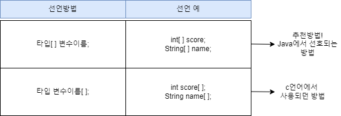
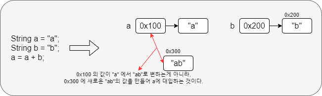
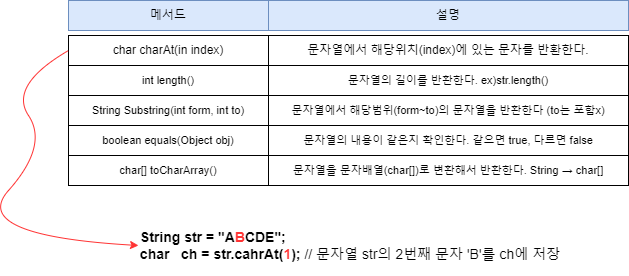
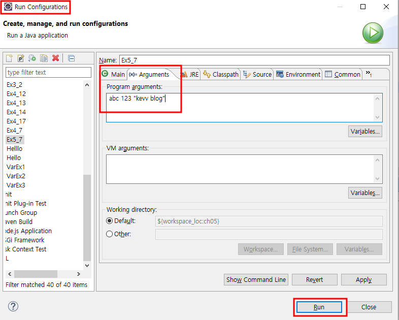
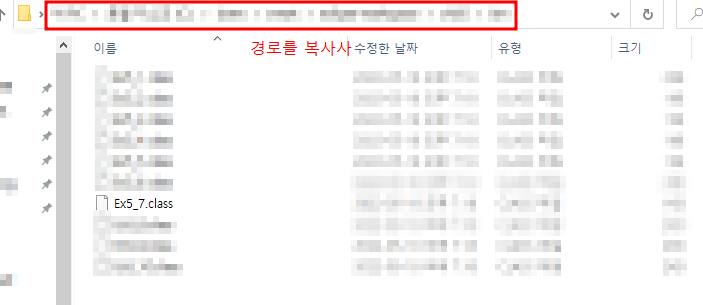
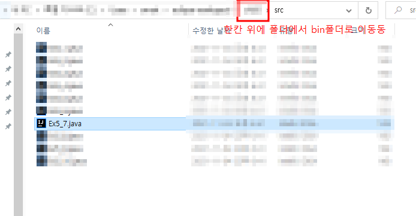
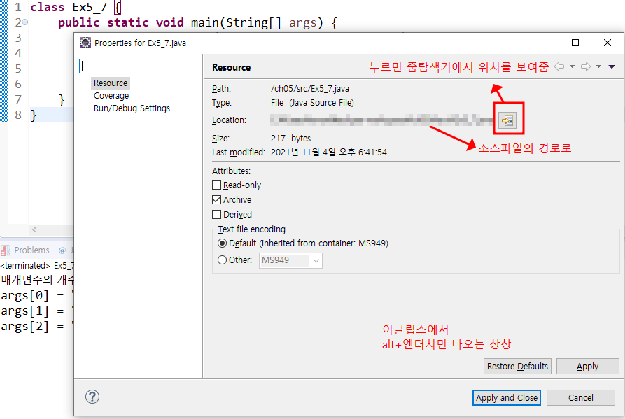
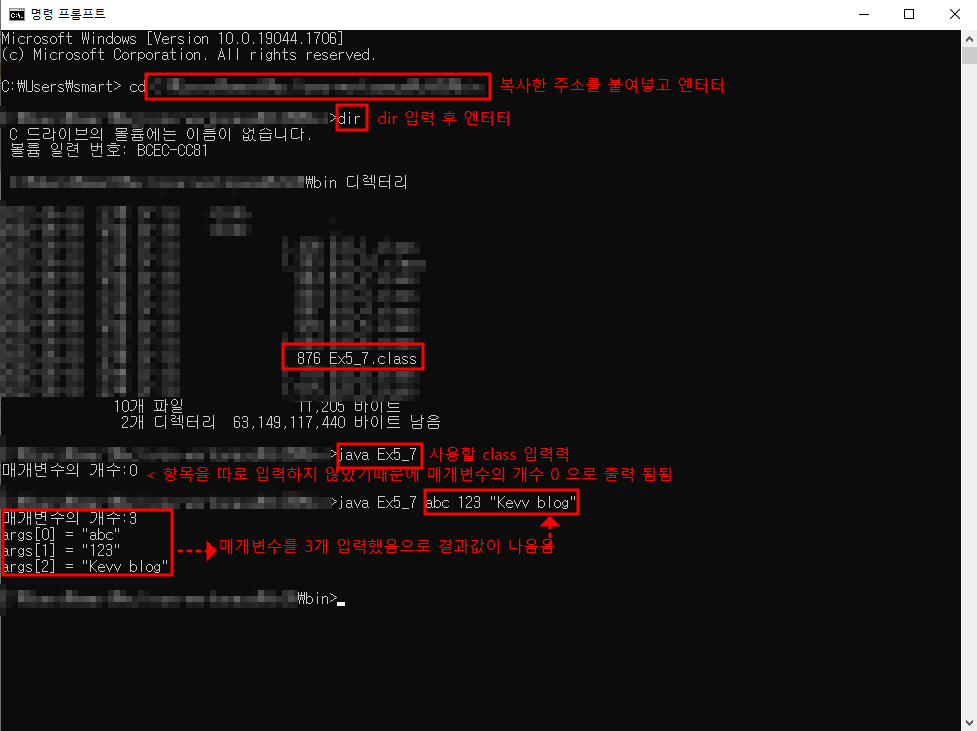
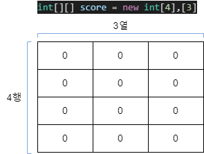
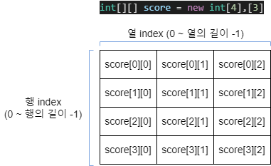

# [JAVA의 정석] CH5. 배열(array)

## 01) 배열이란?

- 배열 : 배열은 같은 타입의 여러 변수를 하나의 묶음으로 다루는 것이다.
- 배열은 연속적이다.
- 배열은 참조변수를 통해 저장공간을 사용한다.
- `int[] score = new int[5];` // 5개의 int값을 저장할 수 있는 배열을 생성한다. 

## 02) 배열의 선언과 생성

- 배열을 다루기 위한 참조변수의 선언.
- ① 원하는 타입의 변수를 선언.
- ② 변수 또는 타입에 배열임을 의미하는 대괄호[]를 붙임.



### 배열의 생성

- 배열을 선언하는 것 : 단지 생성된 배열을 다루기 위한 참조변수를 위한 공간이 만들어 질 뿐.
- 배열을 생성해야 비로소 값을 저장할 수 있는 공간이 만들어짐.
- `타입[] 변수이름;`  // 배열을 선언(배열을 다루기 위한 참조변수 선언)
- `변수이름 = new 타입[길이];` // 배열을 생성(실제 저장공간을 생성)

```java
int[] score; // int타입의 배열을 다루기 위한 참조변수 score를 선언
score = new int[5]; // int타입의 값 5개를 저장할 수 있는 배열을 생성

// 위에 2줄을 한줄로도 표현 가능
int [] score; = new int[5]
```

## 03) 배열의 인덱스

- 인덱스(index) : 배열의 요소마다 붙여진 일련번호
- 인덱스는 1이아닌 __0부터__ 시작한다.
- 인덱스(index)의 범위는 0부터 '배열길이 -1'까지.

## 04) 배열의 길이 (배열이름.length)

- 배열은 한번 생성하면 실행하는 동안 그 길이를 바꿀 수 없다.
- 이미 생성된 배열의 길이는 변하지 않으므로 '배열이름.length'는 상수다.
- 배열을 실행하는 동안 길이 변경이 불가능한 이유
  - 왜? : 이미 확보된 연속된 메로리공간을 확보하기 힘들기 때문
  - 메모리가 부족한 경우가 생길 수 있기 때문에 기존 배열의 길이를 바꿀 수 없고 새로운 배열을 만들어야한다.

```java
int[] scroe = new int[5];

for (int i=0; i<score.length; i++)
	System.out.println(score[i]);
```

## 05) 배열의 초기화

- 배열의 각 요소에 처음으로 값을 저장하는 것.
- 초기화 방법
  - ① ` int[] score = new int[]{ 1, 2, 3, 4, 5}; `
  - ② ` int[] score = { 1, 2, 3, 4, 5 }; `
  - 위 2 가지 방법이 있지만, 2번째 방법으로 주로 사용된다.
  - 하지만 ②번을 두 문장으로 바꿀때 ` int[] score; score = { 1, 2, 3, 4, 5}; 가 아닌, int[] score; new int { 1, 2, 3, 4, 5}; 로 표현해야 한다. `

```java
public class Ex2_1 {

	public static void main(String[] args) {
		int[] score;
		score = new int [5];
		// int[] score = new int[5]; 로 줄여서 사용
		
		score[3] = 100;
		
		System.out.println("score[3] = " + score[3]);
		
		int value = score[3];
		
		System.out.println(value);
			
	}

}
```

## 06) 배열의 출력

- for 문과 `Arrays.toString(배열이름)` 메소드를 이용하여 출력할 수 있다.
- `Arrays.toString(배열이름)` 메소드를 사용하기 위해서 `import java.util.Arrays;` 를 추가해야 한다. 

```java
// Arrays.toString(배열이름) 사용하지 않았을 떄
// 배열의 요소를 순서대로 하나씩 출력
import java.util.Arrays;

public class Ex2_1 {

	public static void main(String[] args) {
		
		int[] iArr = { 1, 2, 3, 4, 5 };
		
		for(int i=0; i<iArr.length; i++) {
			System.out.println(i);
		}
		
	}
}
// result
// 0
// 1
// 2
// 3
// 4
```

```java
// Arrays.toString(배열이름) 사용하여 배열을 출력
import java.util.Arrays;

public class Ex2_1 {

	public static void main(String[] args) {
		
		int[] iArr = { 1, 2, 3, 4, 5 };
		
		System.out.println(Arrays.toString(iArr));
		}
		
	}

//result
//[1, 2, 3, 4, 5]
```

- char 배열일 때만,  `System.out.println("변수명")` 을 통해 모든 배열의 요소를 출력 가능

```java
public class Ex2_1 {

	public static void main(String[] args) {
		
		char[] chArr = { 'a', 'b', 'c' };
		System.out.println(chArr);
		
		}
		
	}

//result
//abc
```

## 07) 배열의 출력 예제

```java
import java.util.Arrays;  // Arrays.toString()을 사용하기 위해 추가

class Ex5_1 {
	public static void main(String[] args) {
		int[] iArr1 = new int[10];
		int[] iArr2 = new int[10];
//		int[] iArr3 = new int[]{100, 95, 80, 70, 60};
		int[] iArr3 = {100, 95, 80, 70, 60};
		char[] chArr = {'a', 'b', 'c', 'd'};

		for (int i=0; i < iArr1.length ; i++ ) {
			iArr1[i] = i + 1; // 1~10의 숫자를 순서대로 배열에 넣는다.
		}

		for (int i=0; i < iArr2.length ; i++ ) {
			iArr2[i] = (int)(Math.random()*10) + 1; // 1~10의 값을 배열에 저장
		}

		// 배열에 저장된 값들을 출력한다.
		for(int i=0; i < iArr1.length;i++) {
			System.out.print(iArr1[i]+",");	
		}
		System.out.println();

		System.out.println(Arrays.toString(iArr2));
		System.out.println(Arrays.toString(iArr3));
		System.out.println(Arrays.toString(chArr));
		System.out.println(iArr3);
		System.out.println(chArr);
	}
}
```

## 08) 배열의 활용(1) - 총합과 평균

```java
class Ex5_2 {
	public static void main(String[] args) {
		int   sum = 0;      // 총점을 저장하기 위한 변수
		float average = 0f; // 평균을 저장하기 위한 변수

		int[] score = {100, 88, 100, 100, 90};

		for (int i=0; i < score.length ; i++ ) {
			sum += score[i];
		}
		average = sum / (float)score.length ; // 계산결과를 float로 얻기 위해서 형변환

		System.out.println("총점 : " + sum);
		System.out.println("평균 : " + average);
	}
}
```

## 09 배열의 활용(2) - 최대값과 최소값

```java
class Ex5_3 { 
	public static void main(String[] args) { 
		int[] score = { 79, 88, 91, 33, 100, 55, 95 }; 

		int max = score[0]; // 배열의 첫 번째 값으로 최대값을 초기화 한다. 
		int min = score[0]; // 배열의 첫 번째 값으로 최소값을 초기화 한다. 

		for(int i=1; i < score.length;i++) {
			if(score[i] > max) { 
				max = score[i]; 
			} else if(score[i] < min) { 
				min = score[i]; 
			} 
		} // end of for 

		System.out.println("최대값 :" + max);       
		System.out.println("최소값 :" + min);       
	} // end of main 
} // end of class
```

## 10) 배열의 활용(3) - 섞기(shuffle)

```java
import java.util.Arrays;

class Ex5_4 {
	public static void main(String[] args) {
		int[] numArr = {0,1,2,3,4,4,5,6,7,8,9};
		System.out.println(Arrays.toString(numArr));

		for (int i=0; i < 100; i++ ) {
			int n = (int)(Math.random() * 10);  // 0~9 중의 한 값을 임의로 얻는다.
			int tmp = numArr[0];		// tmp를 통해 서로 값을 바꿀 수 있는 임시공간을 생성해준다.
			numArr[0] = numArr[n];
			numArr[n] = tmp;
		}
		System.out.println(Arrays.toString(numArr));
	} // main의 끝
}
```

## 11) 배열의 활용(4) - 로또 번호 만들기

```java
class Ex5_5 { 
	public static void main(String[] args) { 
		int[] ball = new int[45];  // 45개의 정수값을 저장하기 위한 배열 생성.      

		// 배열의 각 요소에 1~45의 값을 저장한다. 
		for(int i=0; i < ball.length; i++)       
			ball[i] = i+1;    // ball[0]에 1이 저장된다. (초기화된 처음값이 0이기 때문에 +1 해준다.)

		int tmp = 0;   // 두 값을 바꾸는데 사용할 임시변수 
		int j = 0;     // 임의의 값을 얻어서 저장할 변수 

		// 배열의 i번째 요소와 임의의 요소에 저장된 값을 서로 바꿔서 값을 섞는다. 
		// 0번째 부터 5번째 요소까지 모두 6개만 바꾼다.
		for(int i=0; i < 6; i++) {       
			j = (int)(Math.random() * 45); // 0~44범위의 임의의 값을 얻는다. 
			tmp     = ball[i]; 
			ball[i] = ball[j]; 
			ball[j] = tmp; 
		} 

		// 배열 ball의 앞에서 부터 6개의 요소를 출력한다.
		for(int i=0; i < 6; i++) 
			System.out.printf("ball[%d]=%d%n", i, ball[i]); 
	} 
}
```

## 12) String배열의 선언과 생성

- String[] name = new String[3]; // 3개의 문자열을 담을 수 있는 배열을 생성한다.

## 13) String배열의 초기화

- int배열과 동일한 방식으로 초기화 한다.

```java
String[] name = new String[3];
name[0] = "Kevv"
name[1] = "blog"
name[3] = "Study"
```

- 괄호{}를 통해 간단히 초기화 할 수 있다.

```java
String[] name = { "kevv" , "blog", "Study"};
```

```java
//가위 바위 보 출력
import java.util.Arrays;

public class Ex2_1 {

	public static void main(String[] args) {
	
		String[] user = { "가위", "바위", "보" };
		System.out.println(Arrays.toString(user));
		
		for(int i=0; i<10; i++) {
			int tmp = (int)(Math.random()*3);
			System.out.println(user[tmp]); // user[] 인덱스에 0~2 중 랜덤하게 출력 (가위, 바위, 보) 중 랜덤
			
		}
	}		
}		
```
## 14) String클래스

- Stirng클래스는 char배열에 메서드(기능)을 추가한 것이다.
- String클래스 = char[] + 메서드(기능)
- String은 char배열이다.
- String객체(문자열)는 읽을수만 있을 뿐 내용을 변경할 수는 없다. (read only)



## 15) String클래스의 주요 메서드



```java
public class Ex2_1 {

	public static void main(String[] args) {
		
		String str = "ABCDE";
		char ch = str.charAt(3);
		System.out.println(ch);
		
		String str2 = str.substring(1,4); //1~3 까지
		System.out.println(str2);
		String str3 = str.substring(0); //0부터 ~끝까지
		System.out.println(str3);
		String str4 = str.substring(1, str.length()); //1부터 ~ 끝까지
		System.out.println(str4);
		
	}
}

//result
//D
//BCD
//ABCDE
//BCDE
```

## 16) 커맨드 라인을 통해 입력받기

- Scanner클래스의 nextLine() 외에 커맨드 라인을 이용한 입력방법.

```java
class Ex5_7 {
	public static void main(String[] args) {
		System.out.println("매개변수의 개수:"+args.length);
		for(int i=0;i< args.length;i++) {
			System.out.println("args[" + i + "] = \""+ args[i] + "\"");
		}
	}
}	
```












## 18) 2차원 배열의 선언

- 2차원 배열은 1차원 배열의 배열이다.
- 테이블 형태의 데이터를 저장하기 위한 배열
- 선언방법 : `타입[][] 변수이름;`
> 3차원 이상의 고차원 배열의 선언은 대괄호[]의 개수를 차원의 수만큼 추가해 주기만 하면 된다.

```java
int[][] score = new int[4],[3] // 4행 3열의 2차원 배열 생성 (총 12개의 저장공간 필요)
```



## 19) 2차원 배열의 인덱스

- 2차원 배열은 행(row)과 열(column)로 구성되어있기 때문에 index도 행과 열에 각각 하나씩 존재함.

```java
int[][] score = new int[4][3]; // 4행 3열의 2차원 배열 score생성
```



## 20) 2차원 배열의 초기화

- `int[][] arr = { {1, 2, 3}, {4, 5, 6}};`  

```java
//직관적으로 보기 좋게 표기하는걸 추천
int[][] arr = {
				{1, 2, 3},
				{4, 5, 6}
};
```

## 21) 2차원 배열의 초기화 ex_1)

- 2차원 배열 : 이중반복문 사용
- `score.length;` → 행의 길이
- `score[i].length;` → 열의 길이

```java
class Ex5_8 {
	public static void main(String[] args) {
		int[][] score = {
				  { 100, 100, 100 }
				, { 20, 20, 20 }
				, { 30, 30, 30 }
				, { 40, 40, 40 }
		};
		int sum = 0;

		for (int i = 0; i < score.length; i++) {
			for (int j = 0; j < score[i].length; j++) {
				System.out.printf("score[%d][%d]=%d%n", i, j, score[i][j]);

				sum += score[i][j];
			}
		}

		System.out.println("sum=" + sum);
	}
}
```

## 22) 2차원 배열의 초기화 ex_2)

```java
class Ex5_9 {
	public static void main(String[] args) {
		 int[][] score = {
							  { 100, 100, 100}
							, { 20, 20, 20}
							, { 30, 30, 30}
							, { 40, 40, 40}
							, { 50, 50, 50}
						};
		// 과목별 총점
		int korTotal = 0, engTotal = 0, mathTotal = 0;

	    System.out.println("번호  국어  영어  수학  총점  평균 ");
	    System.out.println("=============================");

		for(int i=0;i < score.length;i++) {
			int  sum = 0;      // 개인별 총점
			float avg = 0.0f;  // 개인별 평균

			korTotal  += score[i][0];
			engTotal  += score[i][1];
			mathTotal += score[i][2];
			System.out.printf("%3d", i+1);

			for(int j=0;j < score[i].length;j++) {
				sum += score[i][j]; 
				System.out.printf("%5d", score[i][j]);
			}

			avg = sum/(float)score[i].length;  // 평균계산
			System.out.printf("%5d %5.1f%n", sum, avg);
		}

		System.out.println("=============================");
     	System.out.printf("총점:%3d %4d %4d%n", korTotal, engTotal, mathTotal);
	}
}
```

## 23) 2차원 배열의 초기화 ex_3)

- 지시자 `%d` : 정수 , `%s` : 문자열

```java
import java.util.Scanner;

class Ex5_10{
	public static void main(String[] args) {
		String[][] words = {
			{"chair","의자"},      	// words[0][0], words[0][1]
			{"computer","컴퓨터"}, 	// words[1][0], words[1][1]
			{"integer","정수"}     	// words[2][0], words[2][1]
		};

		Scanner scanner = new Scanner(System.in);

		for(int i=0;i<words.length;i++) {
			System.out.printf("Q%d. %s의 뜻은?", i+1, words[i][0]);

			String tmp = scanner.nextLine();

			if(tmp.equals(words[i][1])) {
				System.out.printf("정답입니다.%n%n");
			} else {
			   System.out.printf("틀렸습니다. 정답은 %s입니다.%n%n",words[i][1]);
			}
		} // for
	} // main의 끝
}
```

## 24) Array로 배열 다루기

- Array 클래스 : 배열을 다루는데 유용한 클래스

### 배열의 비교와 출력

- `equals()` : 배열이 같은지 아닌지 판단.
- `toString()` : 배열에 저장된 값을 문자열로 출력

```java
String[][] str2D = new String[][]{{"aa", "bb"}, {"AA", "BB"}};
String[][] str3D = new String[][]{{"aa", "bb"}, {"AA", "BB"}};

System.out.println(Arrays.equals(str2D, str3D)); //false, 1차원 배열이 아니기때문에
System.out.println(Arrays.deepEquals(str2D, str3D)); //true
``` 

```java
int[] arr = {0, 1, 2, 3, 4};
int[] arr2D = {{11,12}, {13,14}};

System.out.println(Arrays.toString(arr)); // [0, 1, 2, 3, 4]
System.out.println(Arrays.deepToString(arr2D)); //[[11,12], [13,14]]
```

### 배열의 복사 - copyOf(), copyOfRange()

- `copyOf()` : 배열의 전체를 복사
- `copyOfRange()` : 배열의 일부를 복사(From ~ To)

```java

int[] arr = { 0, 1, 2, 3, 4};
int[] arr2 = Arrays.copyOf(arr, arr.length); // arr2 = [ 0, 1, 2, 3, 4 ]
int[] arr3 = Arrays.copyOf(arr, 3); // arr3 = [ 0, 1, 2 ]
int[] arr4 = Arrays.copyOf(arr, 7); // arr4 = [ 0, 1, 2, 3, 4, 0, 0 ] ← 범위를 벗어나면 0으로 추가됨
int[] arr5 = Arrays.copyOfRange(arr, 2, 4); // arr5 = [ 2,3 ] ← 4는 불포함 
int[] arr6 = Arrays.copyOfRange(arr, 0, 7); // arr6 = [ 0, 1, 2, 3, 4, 0, 0 ]
```

### 배열의 정렬 - sort()

- `sort()` : 오름차순으로 정렬(낮은 수 부터)

```java
int[] arr = { 0, 3, 4, 2, 1};
Arrays.sort(arr); // 배열 arr을 정렬한다.
System.out.println(Arrays.toString(arr)); // [0, 1, 2, 3, 4]
```