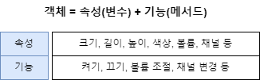

# [JAVA의 정석] CH6. 객체지향 프로그래밍 1-1

## 01) 객체지향 언어

- 코드의 재사용성이 높다.
  - 새로운 코드를 작성할 때 기존의 코드를 이용하여 쉽게 작성할 수 있다.
- 코드의 관리가 용이하다.
  - 코드간의 관계를 이용해서 적은 노력으로 쉽게 코드를 변경할 수 있다.
- 신뢰성이 높은 프로그래밍을 가능하게 한다.
  - 제어자와 메서드를 이용하여 데이터를 보호하고 올바른 값을 유지하도록 하며, 코드의 중복을 제거하여 코드의 불일치로 인한 오작동을 방지할 수 있다.
- __1.캡슐화 2.상속 3.추상화 4.다형성__ 의 특징을 가지고 있다.

## 02) 클래스와 객체

- `클래스` : 클래스란 객체를 정의해 놓은 것 ex) TV설계도
- 클래스의 용도: 클래스는 객체를 생성하는 데 사용.

- `객체` : 실제로 존재하는 것. 사물 또는 개념 ex) TV
- 객체의 용도 : 객체가 가지고 있는 기능과 속성에 따라 다르게 쓰임.

- 유형의 객체 : 책상, 의자, TV 와 같은 사물.
- 무형의 객체 : 수학공식, 프로그램 에러와 같은 논리나 개념.

- __객체를 상용하기 위해서는 1) 클래스로부터 객체를 생성하는 과정이 선행되어야 한다. 2) 클래스로부터 객체를 생성하여 사용한다.__


## 03) 객체의 구성요소 - 속성과 기능

- 객체는 속성과 기능, 두 종류의 구성요소로 이루어져 있다.
- 객체는 속성과 기능의 집합.
- 객체가 가지고 있는 속성과 기능을 그 객체의 멤버(memeber)라 한다.




## 04) 객체와 인스턴스

- `객체` : 모든 인스턴스를 대표하는 일반적 용어.
- `인스턴스` : 특정 클래스로 부터 생성된 객체. ex) Tv 인스턴스

- `클래스` → 인스턴스화 → `인스턴스(객체)`

- 클래스(설계도)가 왜 필요할까? : 객체(제품)를 만들어 내기 위해.
- 객체는 왜 필요한가? : 객체(제품)을 사용(활용)하기 위해.
- 객체를 사용한다는 것은? : 객체가 가진 속성(변수)과 기능(메서드)를 사용한다.

## 06) 객체의 생성과 사용

- `변수` 와 `메서드` 사용
- `참조변수` : 객체를 다루기 위한 리모컨 이라고 생각하면 이해하기 용이하다. 

```java

클래스명 변수명;          // 클래스의 객체를 참조하기 위한 참조변수를 선언
변수명 = new 클래스명();  // 클래스 객체를 생성 후, 객체의 주소를 참조변수에 저장.

Tv t;           // Tv클래스 타입의 참조변수 t를 선언
t = new Tv();   // Tv인스턴스를 생성한 후, 생성된 Tv인스턴스의 주소를 t에 저장.

```

```java
class Ex6_1 { 
	public static void main(String args[]) { 
		Tv t;                 // Tv인스턴스를 참조하기 위한 변수 t를 선언       
		t = new Tv();         // Tv인스턴스를 생성한다. 
		t.channel = 7;        // Tv인스턴스의 멤버변수 channel의 값을 7로 한다. 
		t.channelDown();      // Tv인스턴스의 메서드 channelDown()을 호출한다. 
		System.out.println("현재 채널은 " + t.channel + " 입니다."); 
	} 
}

class Tv { 
	// Tv의 속성(멤버변수)   
	String color;           // 색상 
	boolean power;         	// 전원상태(on/off) 
	int channel;           	// 채널 

	// Tv의 기능(메서드) 
	void power()   { power = !power; }  // TV를 켜거나 끄는 기능을 하는 메서드  
	void channelUp()   {  ++channel; }  // TV의 채널을 높이는 기능을 하는 메서드 
	void channelDown() { --channel; }   // TV의 채널을 낮추는 기능을 하는 메서드  
}
```

- `인스턴스는 참조변수를 통해서만 다룰 수 있으며, 참조변수의 타입은 인스턴스의 타입과 일치해야 한다.`


## 08) 객체배열

- `객체배열` == `참조변수 배열`

```java

Tv[] tvArr = new Tv[3]; // 길이가 3인 Tv타입의 참조변수 배열

```