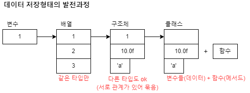
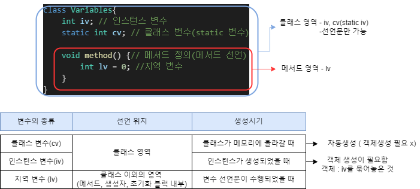
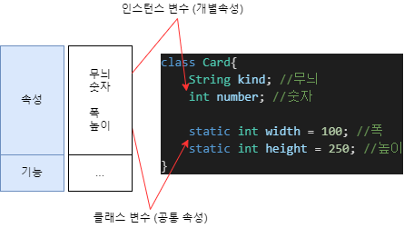
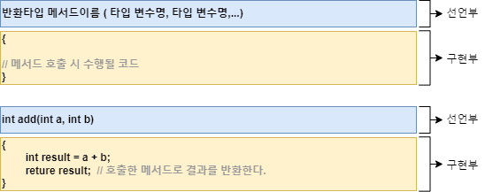
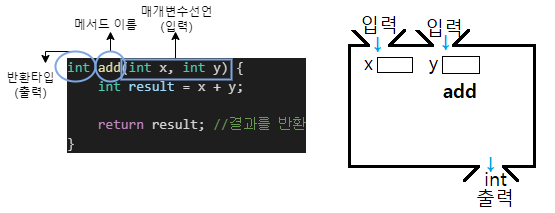
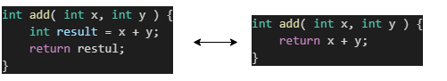
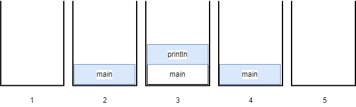

# [JAVA의 정석] CH6. 객체지향 프로그래밍-2

## 09) 클래스의 정의(1) - 데이터 함수의 결합

- `클래스`
  - 설계도
  - Data + 함수
  - 사용자 정의 타입.
  - 객체를 생성하기 위한 틀



- `변수` : 하나의 데이터를 저장할 수 있는 공간
- `배열` : 같은 종류의 여러 데이터를 하나의 집합으로 저장할 수 있는 공간
- `구조체` : 서로 관련된 여러 데이터를 종류에 관계없이 하나의 집합으로 저장할 수 있는 공간
- `클래스` : 데이터와 함수의 결합(구조체 + 함수)

## 10) 클래스의 정의(2) - 사용자 정의 타입

- `사용자정의 타입(user-defined type)` : 원하는 타입(클래스)를 직접 만들 수 있다.

```java
class Time { // 클래스를 이용하여 원하는 사용자 정의타입 'Time' 생성
	int hour;
	int minute;
	float second;
}
```

## 11) 선언위치에 따른 변수의 종류

- 변수의 종류 : `클래스 변수(cv)` , `인스턴스 변수(iv)` , `지역 변수(lv)`



## 12) 클래스 변수와 인스턴스 변수

- 인스턴스 변수는 인스턴스가 생성될 때 마다 생성되므로 인스턴스마다 각기 다른 값을 유지할 수 있지만, 클래스 변수는 모든 인스턴스가 하나의 저장공간을 공유하므로, 항상 공통된 값을 갖는다.



## 13) 클래스 변수와 인스턴스 변수 예제

```java
class Ex6_3 {
	public static void main(String args[]) {
		System.out.println("Card.width = " + Card.width);
		System.out.println("Card.height = " + Card.height); // 클래스 변수 (static 변수)는 객체생성 없이 '클래스이름.클래스 변수' 로 직접 사용 가능.

		Card c1 = new Card();
		c1.kind = "Heart"; // 인스턴스 변수의 값을 변경
		c1.number = 7; // 인스턴스 변수의 값을 변경

		Card c2 = new Card();
		c2.kind = "Spade"; // 인스턴스 변수의 값을 변경
		c2.number = 4; // 인스턴스 변수의 값을 변경

		System.out.println("c1은 " + c1.kind + ", " + c1.number + "이며, 크기는 (" + c1.width + ", " + c1.height + ")");
		System.out.println("c2는 " + c2.kind + ", " + c2.number + "이며, 크기는 (" + c2.width + ", " + c2.height + ")");
		System.out.println("c1의 width와 height를 각각 50, 80으로 변경합니다.");
		Card.width = 50; // 클래스 변수의 값을 변경한다.
		Card.height = 80; // 클래스 변수의 값을 변경한다.

		System.out.println("c1은 " + c1.kind + ", " + c1.number + "이며, 크기는 (" + c1.width + ", " + c1.height + ")");
		System.out.println("c2는 " + c2.kind + ", " + c2.number + "이며, 크기는 (" + c2.width + ", " + c2.height + ")");
	}
}

class Card {
	String kind;
	int number;
	static int width = 100;
	static int height = 250;
}
```

## 14) 메서드란?

- `메서드` : 특정 작업을 수행하는 일련의 문장들을 하나로 묶은 것.
- `메서드` 는 `선언문(header)` 와 `구현부(body)` 로 이루어져 있다.
- 메서드의 장점 : 
  - 코드의 중복을 줄여준다.
  - 코드 관리를 용이하게 한다.
  - 코드를 재사용 가능하게 한다.
  - 코드가 간결하여 이해하기 쉽게 한다.
- 메서드의 작성 :
  - 반복적으로 수행되는 여러 문장을 메서드로 작성한다.
  - 하나의 메서드는 한 가지 기능만을 수행하도록 작성한다.



- 수학의 함수와 달리 메서드는 입력값 또는 출력값(결과값)이 없을 수도 있으며, 심지어 입력값과 출력값이 모두 없을 수도 있다.
- 출력값이 0개 일때 반환타입 `void` 사용

## 15) 메서드의 선언부



## 16) 메서드의 구현부

- 메서드 선언문 다음에 오는 괄호{} 를 `메서드의 구현부` 라고 한다.

- `return문` : 메서드 반환타입이 `void` 가 아닌 경우, 구현부{} 안에 'return 반환값;' 이 반드시 포함되어야 한다.


## 17) 메서드의 호출

```java
메서드이름(값1, 값2, ...); //메서드를 호출하는 방법

print99danAll(); //void print99danAll()을 호출
int result = add(3, 5); // int add(int x, int y)를 호출하고, 결과를 rseult에 저장.
```

## 18) 메서드의 실행 흐름

1. 객체 생성
2. 객체 호출

## 19) 메서드의 실행 흐름 예제

```java
class Ex6_4 {
	public static void main(String args[]) {
		MyMath mm = new MyMath();
		long result1 = mm.add(5L, 3L);
		long result2 = mm.subtract(5L, 3L);
		long result3 = mm.multiply(5L, 3L);
		double result4 = mm.divide(5L, 3L);

		System.out.println("add(5L, 3L) = " + result1);
		System.out.println("subtract(5L, 3L) = " + result2);
		System.out.println("multiply(5L, 3L) = " + result3);
		System.out.println("divide(5L, 3L) = " + result4);
	}
 }

 class MyMath {
	long add(long a, long b) {
		long result = a + b;
		return result;
	//	return a + b;	// 위의 두 줄을 이와 같이 한 줄로 간단히 할 수 있다.
	}
	long subtract(long a, long b) { return a - b; }
	long multiply(long a, long b) { return a * b; }
	double divide(double a, double b) {
		return a / b;
	}
 }
```

## 20) return문

- return문은 현재 실행중인 메서드를 종료하고 호출한 메서드로 되돌아간다.
- 반환타입이 void인 경우, return문 없이도 아무런 문제가 없다.
  - 컴파일러가 메서드의 마지막에 'return;'을 자동으로 추가해주기 때문.

## 21) 반환값



- 수학에서처럼, result값이 'x+y'와 같으므로 result 대신 'x+y'를 쓸 수 있다고 생각하면 된다.

## 22) 호출스택(call stack)

- `호출스택` : 메서드의 작업에 필요한 메모리 공간을 제공한다.
- 스택 : 밑이 막힌 상자 → 차곡차곡 쌓인다.

```java
class Ex6_5 {
	public static void main(String[] args) {
		System.out.println("Hello");		
	}
}
```


1. 
