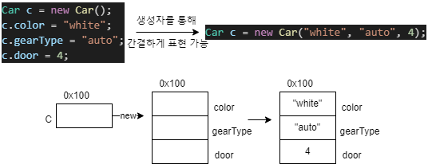

# [JAVA의 정석] CH6. 객체지향 프로그래밍 1-3

## 23) 기본형 매개변수

- 기본형 매개변수 : 변수의 값을 읽기만 할 수 있다. (read only)
  - 기본형의 값을 저장.
- 참조형 매개변수 : 변수의 값을 읽고 변경할 수 있다. (read & write)
  - 인스턴스의 주소를 복사.

```java
class Data { int x; }

class Ex6_6 {
	public static void main(String[] args) {
		Data d = new Data();
		d.x = 10;
		System.out.println("main() : x = " + d.x);

		change(d.x);
		System.out.println("After change(d.x)");
		System.out.println("main() : x = " + d.x);
	}

	static void change(int x) {  // 기본형 매개변수
		x = 1000;
		System.out.println("change() : x = " + x);
	}
}
```

## 24) 참조형 매개변수

```java
class Data2 { int x; }

class Ex6_7 {
	public static void main(String[] args) {
		Data2 d = new Data2();
		d.x = 10;
		System.out.println("main() : x = " + d.x);

		change(d);
		System.out.println("After change(d)");
		System.out.println("main() : x = " + d.x);
	}

	static void change(Data2 d) { // 참조형 매개변수
		d.x = 1000;
		System.out.println("change() : x = " + d.x);
	}
}
```

## 26) static 메서드와 인스턴스 메서드

- 메서드 앞에 static이 붙어 있으면 클래스 메서드 (iv 사용x)
- static이 붙어있지 않으면 인스턴스 메서드 (iv 사용)

- 인스턴스 메서드
  - 인스턴스 생성 후, `참조변수.메서드이름()` 으로 호출
  - 인스턴스 멤버 (iv, im)와 관련된 작업을 하는 메서드
  - 메서드 내에서 iv 사용 가능
- static메서드(클래스 메서드) ex) Math.round(), Math.random()
  - 객체생성 없이 `클래스이름.메서드이름()` 으로 호출
  - 인스턴스 멤버와 관련없는 작업을 하는 메서드
  - 메서드 내에서 iv 사용 불가

## 27) static 메서드와 인스턴스 메서드 예제

```java
class MyMath2 {
	long a, b;

	// 인스턴스 변수 a, b만을 잉요해서 작업하므로 매개변수가 필요없다.
	long add()		{ return a + b; }  // a, b는 인스턴스 변수
	long subtract() { return a - b; }
	long multiply() { return a * b; }
	double divide() { return a / b; }

	// 인스턴스 변수와 관계없이 매개변수만으로 작업이 가능하다.
	static long   add(long a, long b)		 { return a + b; }  // a, b는 지역변수
	static long   subtract(long a, long b)   { return a - b; }
	static long   multiply(long a, long b)   { return a * b; }
	static double divide(long a, long b) { return a / (double)b; }
	
}


class Ex6_9 {
	public static void main(String args[]) {
		// 클래스 메서드 호출. 인스턴스 생성없이 호출가능
		System.out.println(MyMath2.add(200L, 100L));
		System.out.println(MyMath2.subtract(200L, 100L));
		System.out.println(MyMath2.multiply(200L, 100L));
		System.out.println(MyMath2.divide(200L, 100L));

		MyMath2 mm = new MyMath2(); // 인스턴스를 생성
		mm.a = 200L;
		mm.b = 100L;
		// 인스턴스 메서드는 객체생성 후에만 호출이 가능함.
		System.out.println(mm.add());
		System.out.println(mm.subtract());
		System.out.println(mm.multiply());
		System.out.println(mm.divide());
   }
}
```

## 28) static을 언제 붙여야 할까?

- iv 말고 따로 lv를 설정해서 사용해야 할 때.

1. 클래스를 설계할 때 멤버변수 중 모든 인스턴스에 공통으로 사용하는 것에 static을 붙인다.
2. 클래스 변수(static변수) 는 인스턴스를 생성하지 않아도 사용할 수 있다.
3. 클래스 메서드(static 메서드)는 인스턴스 변수를 사용할 수 없다.
4. 메서드 내에서 인스턴스 변수를 사용하지 않는다면, static을 붙이는 것을 고려한다.

## 29) 메서드 간의 호출과 참조

```java
class TestClass2{
	int iv; // 인스턴스 변수
	static int cv; // 클래스 변수
	
	void instanceMethod() { // 인스턴스 메서드 (iv 사용)
		System.out.println(iv); // 인스턴스 변수 사용 가능
		System.out.println(cv); // 인스턴스 변수 사용 가능
	}
	
	static void staticMethod() { // static 메서드
		System.out.println(iv); // 에러!  인스턴스 변수를 사용할 수 없다. (따로 lv객체를 생성해서 lv를 사용)
		System.out.println(cv); // 클래스 변수는 사용할 수 있다.
	}
}
```

## 30) 오버로딩(overloading)

- 원래는 `메서드 1 : 메서드이름 1` 비율로 사용
- 오버로딩은 `메서드 n : 메서드이름1` 비율로 사용 가능
- `메서드 오버로딩` == `오버로딩`
  - 한 클래스 내에 같은 이름의 메서드를 여러 개 정의하는 것.
	1. 메서드 이름이 같아야 한다.
	2. 매개변수의 개수 __또는__ 타입이 달라야 한다.
	3. 반환 타입은 관계 없다.
- 자바의정석 p.192 ~ p.193

## 31) 오버로딩(overloading) 예제

```java
class Ex6_10 {
	public static void main(String args[]) {
		MyMath3 mm = new MyMath3();
		System.out.println("mm.add(3, 3) 결과:"    + mm.add(3,3));
		System.out.println("mm.add(3L, 3) 결과: "  + mm.add(3L,3));
		System.out.println("mm.add(3, 3L) 결과: "  + mm.add(3,3L));
		System.out.println("mm.add(3L, 3L) 결과: " + mm.add(3L,3L));

		int[] a = {100, 200, 300};
		System.out.println("mm.add(a) 결과: " + mm.add(a));
   }
}

class MyMath3 {
	int add(int a, int b) {
		System.out.print("int add(int a, int b) - ");
		return a+b;
	}
	
	long add(int a, long b) {
		System.out.print("long add(int a, long b) - ");
		return a+b;
	}
	
	long add(long a, int b) {
		System.out.print("long add(long a, int b) - ");
		return a+b;
	}

	long add(long a, long b) {
		System.out.print("long add(long a, long b) - ");
		return a+b;
	}

	int add(int[] a) {		// 배열의 모든 요소의 합을 결과로 돌려준다.
		System.out.print("int add(int[] a) - ");
		int result = 0;
		for(int i=0; i < a.length;i++) 
			result += a[i];
		
		return result;
	}
}
```

## 32) 생성자(constructor)

- `생성자` : 인스턴스가 생성될 때 호출되는 '인스턴스 초기화 메서드'
	1. 생성자의 이름은 클래스의 이름과 같아야 한다.
	2. 생정자는 리턴값이 없다. (void는 안붙임)
	3. 모든 클래스는 반드시 생성자를 가져야 한다.
- 인스턴스 초기화 : 인스턴스 변수들을 초기화 하는것.


## 33) 기본 생성자(default constructor)

- 매개변수가 없는 생성자.
- 생성자가 하나도 없을 때만 컴파일러가 자동으로 추가한다.

```java
class Data_1 {
//	Data_1(){} ← 생성자가 하나도 없기 때문에 컴파일러가 자동으로 추가시켜 줌(굳이 작성 할 필요 없음)
	int value;
	
}

class Data_2 {
	int value;

//	Data_2(){} ← 를 넣어주면 에러 해결 됨 (2번째 생성자이기 때문에 기본생성자 생성해야 함)
	Data_2(int x) {   // 매개변수가 있는 생성자.
		value = x;
	}
}

class Ex6_11 {
	public static void main(String[] args) {
		Data_1 d1 = new Data_1();
		Data_2 d2 = new Data_2(); // compile error발생
	}
}
```

## 34) 매개변수가 있는 생성자



## 35) 매개변수가 있는 생성자 예제

```java
class Car {
	String color;		// 색상
	String gearType;	// 변속기 종류 - auto(자동), manual(수동)
	int door;			// 문의 개수

	Car() {}

	Car(String c, String g, int d) {
		color = c;
		gearType = g;
		door = d;
	}
}

class Ex6_12 {
	public static void main(String[] args) {
		Car c1 = new Car();
		c1.color    = "white";
		c1.gearType = "auto";
		c1.door = 4;

		Car c2 = new Car("white", "auto", 4);

		System.out.println("c1의 color=" + c1.color + ", gearType=" + c1.gearType+ ", door="+c1.door);
		System.out.println("c2의 color=" + c2.color + ", gearType=" + c2.gearType+ ", door="+c2.door);
	}
}
```

## 36) 생성자에서 다른 생성자 호출하기 - this()

- 생성자의 이름으로 클래스 이름대신 this를 사용한다.
- 한 생성자에서 다른 생성자를 호출할 때는 반드시 첫 줄에서만 호출이 가능하다.

```java
Car(String color) {
	door = 5; // 첫 번째 줄
	Car(color, "auto", 4);   //에러1. 생성자의 두 번째 줄에서 다른 생성자 호출
}						     //에러2. this(color, "auto", 4); 로 바꾸어야 한다.
```

```java
class Car2 {
	String color;		// 색상
	String gearType;	// 변속기 종류 - auto(자동), manual(수동)
	int door;			// 문의 개수

	Car2() {
		this("white", "auto", 4);
	}

	Car2(String color) {
		this(color, "auto", 4);
	}

	Car2(String color, String gearType, int door) {
		this.color = color;
		this.gearType = gearType;
		this.door = door;
	}
}
class Ex6_13 {
	public static void main(String[] args) {
		Car2 c1 = new Car2();	
		Car2 c2 = new Car2("blue");

		System.out.println("c1의 color=" + c1.color + ", gearType=" + c1.gearType+ ", door="+c1.door);
		System.out.println("c2의 color=" + c2.color + ", gearType=" + c2.gearType+ ", door="+c2.door);
	}
}
```

## 37) 객체 자신을 가리키는 참조변수 -this

- `this` : 인스턴스 자신을 가리키는 참조변수, 인스턴스의 주소가 저장되어 있다.
  - 모든 인스턴스메서드에 지역변수로 숨겨진 채로 존재한다.
- `this()` , `this(매개변수)` : 생성자. 같은 클래스의 다른 생성자를 호출할 때 사용한다.
  - 클래스 이름 대신 this() 사용.

- this 와 this()는 비슷하게 생겼을 뿐, __완전히 다른 것__ 이다.
- this 는 참조변수
- this() 는 생성자.

## 38) 변수의 초기화

- 지역변수(lv)는 수동 초기화 해야 한다.

```java
class InitTest{
	int x; // 인스턴스 변수
	int y = x; // 인스턴스 변수
	
	void method1() {
		int i; // 지역변수
		int j = i; // 에러, 지역변수를 초기화 하지 않고 사용.
	}
}
```

- 멤버변수(클래스 변수와 인스턴스 변수)와 배열의 초기화는 선택이지만, __지역변수의 초기화는 필수이다.__

## 39) 멤버변수의 초기화

1) 자동초기화 - 0
2) 간단초기화 - =(대입)
3) 복잡초기화 - {}, static{}, 생성자 초기화

- 클래스 변수(cv) 초기화 → 인스턴스 변수(iv) 초기화
- 자동 초기화 → 명시적 초기화(간단) → 초기화 블럭, 생성자(복잡) 순서대로 진행

### 명시적 초기화(explicit initialization)

- 참조형 변수
  - null(기본값)
  - 객체주소

```java
class Car {
	int door = 4;	// 기본형 변수의 초기화
	Engine e = new Engine(); // 참조형 변수의 초기화
	// 꼭 객체를 만들어서 넣어주여아 한다
}
```

### 초기화 블럭 (initialization block)

- 복잡한 초기화에 사용
- `클래스 초기화 블럭` : 클래스 변수의 복잡한 초기화에 사용된다. cv초기화 / static{}
- `인스턴스 초기화 블럭` : 인스턴수 변수의 복잡한 초기화에 사용된다. iv초기화 / {}

### 생성자 초기화

- iv 초기화
- 복잡한 초기화에 사용됨


```java
class Ex6_14 {
	static {
		System.out.println("static { }");
	}

	{
		System.out.println("{ }");
	}

	public Ex6_14() {
		System.out.println("생성자");
	}

	public static void main(String args[]) {
		System.out.println("Ex6_14 bt = new Ex6_14(); ");
		Ex6_14 bt = new Ex6_14();

		System.out.println("Ex6_14 bt2 = new Ex6_14(); ");
		Ex6_14 bt2 = new Ex6_14();
	}
}
```